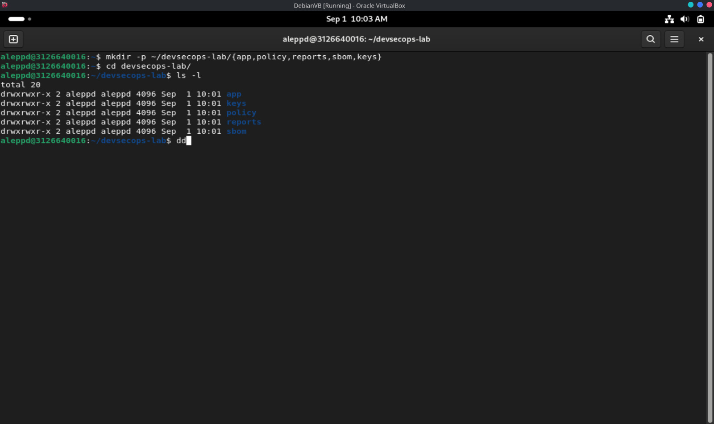
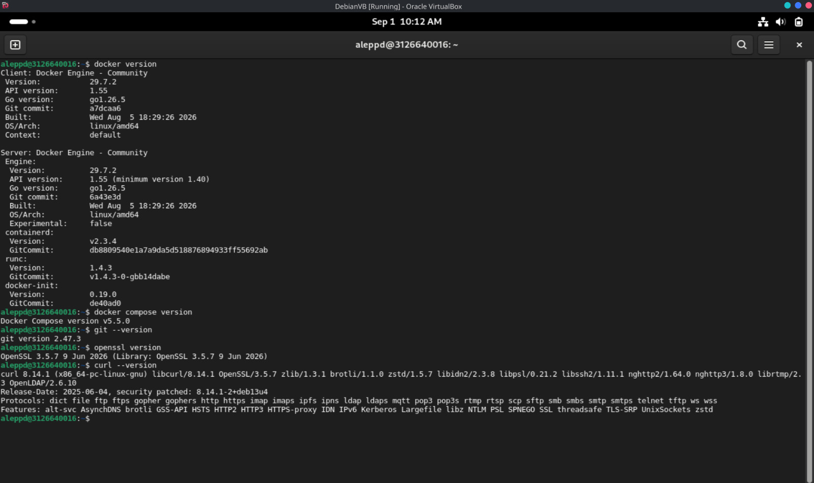
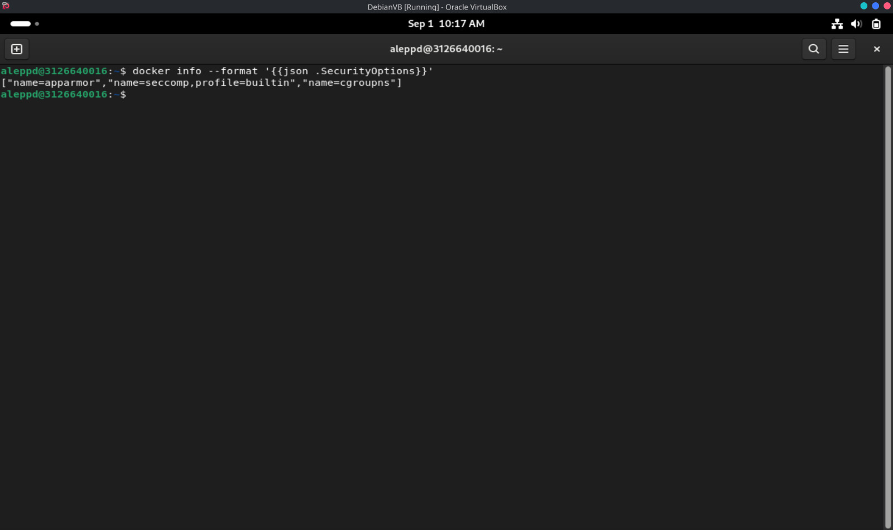

# Laporan bab - 1

<div align="center">
  <h1 style="text-align: center;font-weight: bold">LAPORAN RESMI<br>WORKSHOP DEVOPS</h1>
  <h4 style="text-align: center;">Dosen Pengampu : Dr. Ferry Astika Saputra, S.T., M.Sc.</h4>
</div>
<br />
<div align="center">
  
  <h3 style="text-align: center;">Disusun Oleh : </h3>
  <p style="text-align: center;">
    <strong>Ale Perdana Putra Darmawan (3126640016) </strong><br>
  </p>
<h3 style="text-align: center;line-height: 1.5">Politeknik Elektronika Negeri Surabaya<br>Departemen Teknik Informatika Dan Komputer<br>Program Studi Teknik Informatika<br>2026</h3>
  <hr><hr>
</div>

---

## 1. Tujuan Praktikum

1. Menyiapkan direktori kerja (*workspace*) tunggal sebagai lokasi seluruh eksperimen DevSecOps.
2. Merekam versi komponen laboratorium (Docker, Docker Compose, Git, OpenSSL, curl) sebagai *baseline* yang dapat direproduksi.
3. Memeriksa mekanisme keamanan host yang tersedia pada daemon Docker melalui keluaran `docker info`.
4. Memastikan direktori kerja sensitif (`reports`, `sbom`, `keys`) tidak dipublikasikan dan memiliki izin yang memadai.
5. Menyusun *threat statement* awal sebagai dasar analisis risiko pada praktikum berikutnya.

---

## 2. Alat dan Bahan

| No | Komponen | Keterangan |
| --- | --- | --- |
| 1 | Host Linux / Mesin Virtual | Lingkungan khusus laboratorium (bukan sistem produksi) |
| 2 | Docker Engine | Runtime container |
| 3 | Docker Compose (plugin v2) | Orkestrasi multi-container |
| 4 | Git | Version control |
| 5 | OpenSSL | Utilitas kriptografi (untuk kebutuhan sign/verifikasi) |
| 6 | curl | Klien HTTP untuk pengujian endpoint |
| 7 | Terminal / Shell | Eksekusi perintah |

---

## 3. Langkah Praktikum

### 3.1 Membuat Struktur Direktori Kerja

Seluruh eksperimen pada bab ini dan bab berikutnya menggunakan satu direktori kerja agar artefak mudah ditemukan. Struktur yang dibuat memisahkan aplikasi, kebijakan, laporan, SBOM, dan kunci.

```bash
mkdir -p ~/devsecops-lab/{app,policy,reports,sbom,keys}
cd ~/devsecops-lab
```

Memastikan direktori terbentuk dengan benar sekaligus memeriksa izinnya:

```bash
ls -l ~/devsecops-lab
```

Hasil:



*Gambar 1. Struktur direktori kerja `~/devsecops-lab` beserta izin aksesnya.*

Pada Gambar 1 terlihat lima direktori (`app`, `keys`, `policy`, `reports`, `sbom`) dengan izin `drwxrwxr-x`. Direktori `reports`, `sbom`, dan `keys` tidak dipublikasikan sebagai web root dan hanya dapat diakses oleh pemilik beserta grupnya.

### 3.2 Merekam Versi Komponen (Baseline)

Perekaman versi dilakukan agar setiap temuan pada praktikum selanjutnya dapat ditelusuri ke lingkungan yang spesifik.

```bash
docker version
docker compose version
git --version
openssl version
curl --version
```

Hasil:



*Gambar 2. Versi Docker Engine, plugin Compose, Git, OpenSSL, dan curl.*

### 3.3 Memeriksa Mekanisme Keamanan Docker

Perintah berikut menampilkan opsi keamanan yang tersedia pada daemon/host.

```bash
docker info --format '{{json .SecurityOptions}}'
```

Hasil:



*Gambar 3. Mekanisme keamanan yang tersedia pada daemon/host.*

### 3.4 Menyusun Threat Statement

Praktikan menulis satu paragraf *threat statement* yang memuat empat unsur: **aset**, **aktor ancaman**, **jalur serangan**, dan **dampak**.

Contoh kerangka:

| Unsur | Contoh Isi |
| --- | --- |
| Aset | Image container aplikasi dan kredensial registry pada pipeline |
| Aktor ancaman | Penyerang eksternal maupun pihak internal dengan akses terbatas |
| Jalur serangan | Dependensi berbahaya / secret tertanam yang terekspos melalui repositori |
| Dampak | Penyebaran artefak berbahaya dan kompromi layanan produksi |

---

## 4. Hasil dan Pembahasan

### 4.1 Rekaman Baseline

| Komponen | Perintah | Versi Tercatat |
| --- | --- | --- |
| Docker Engine (client & server) | `docker version` | 29.7.2 (API 1.55) |
| Docker Compose | `docker compose version` | v5.5.0 |
| Git | `git --version` | 2.47.3 |
| OpenSSL | `openssl version` | 3.5.7 (9 Jun 2026) |
| curl | `curl --version` | 8.14.1 (OpenSSL/3.5.7) |

Komponen pendukung yang juga terekam: `containerd` v2.3.4, `runc` 1.4.3, dan `docker-init` 0.19.0.

### 4.2 Mekanisme Keamanan Host

| Butir | Nilai |
| --- | --- |
| Keluaran `SecurityOptions` | `["name=apparmor","name=seccomp,profile=builtin","name=cgroups"]` |
| Distro | Debian (VM `DebianVB` pada Oracle VirtualBox) |
| Mode daemon (rootful/rootless) | Rootful (konteks `default`) |

### 4.3 Struktur Direktori Kerja

| Direktori | Fungsi |
| --- | --- |
| `app` | Berkas aplikasi yang akan dikontainerisasi |
| `policy` | Kebijakan *policy-as-code* |
| `reports` | Bukti hasil pemindaian dan laporan |
| `sbom` | Software Bill of Materials |
| `keys` | Kunci untuk keperluan signing/verifikasi |

### 4.4 Pembahasan

Praktikum ini menegaskan bahwa **baseline adalah bagian dari evidence**. Versi tool yang tercatat memungkinkan hasil scan direproduksi dan dipertanggungjawabkan, karena perubahan perilaku tool maupun basis data kerentanan dapat mengubah temuan tanpa perubahan pada kode aplikasi.

Keluaran `SecurityOptions` tidak boleh disimpulkan sebagai bukti bahwa seluruh container telah *hardened*. Keluaran tersebut hanya menunjukkan mekanisme yang **tersedia** pada daemon/host (yaitu `apparmor`, `seccomp` dengan `profile=builtin`, dan `cgroups`). Apakah kontrol benar-benar diterapkan pada container bergantung pada konfigurasi runtime masing-masing container. Perbedaan hasil antardistribusi merupakan hal wajar dan wajib dicatat sebagai bagian dari baseline.

Pembatasan izin pada direktori `reports`, `sbom`, dan `keys` menerapkan prinsip *least privilege*. Direktori `keys` khususnya menyimpan material sensitif, sehingga tidak boleh berada di dalam web root maupun dapat dibaca pengguna yang tidak berkepentingan.

---

## 5. Analisis Hasil

1. **Reproduksibilitas** — Dengan mencatat versi engine, database, dan rule set, temuan keamanan dapat ditelusuri ke kombinasi lingkungan tertentu. Ini penting ketika hasil pembaruan tool mengubah status temuan tanpa perubahan kode.
2. **Interpretasi `SecurityOptions`** — Mekanisme yang tersedia pada host tidak sama dengan kontrol yang aktif pada container. Verifikasi lanjutan diperlukan pada level konfigurasi container (capability, seccomp profile, user non-root, filesystem read-only).
3. **Perbedaan lingkungan** — Hasil berbeda antardistribusi (misalnya ketersediaan AppArmor vs SELinux, atau mode rootless) dicatat sebagai catatan baseline, bukan dipaksakan agar seragam.
4. **Kesiapan keamanan** — Struktur direktori yang terpisah memudahkan penerapan kontrol pada tahap berikutnya, seperti membatasi akses ke `keys` dan memastikan `reports`/`sbom` tidak terekspos publik.

---

## 6. Troubleshooting

| Gejala | Penyebab Mungkin | Tindakan |
| --- | --- | --- |
| Permission denied pada Docker socket | Akun belum memiliki akses, atau konteks rootless belum aktif | Gunakan mekanisme instalasi resmi; login ulang setelah perubahan grup. Jangan membuka permission socket ke semua pengguna. |
| Compose tidak ditemukan | Plugin Compose v2 belum terpasang | Instal `docker-compose-plugin` dari repositori resmi Docker. |
| `SecurityOptions` kosong atau berbeda | Perbedaan kernel, distro, atau mode daemon | Catat sebagai baseline; jangan memaksakan konfigurasi tanpa memahami dukungan host. |
| Disk cepat penuh | Image dan cache build menumpuk | Gunakan `docker system df`; lakukan pembersihan selektif setelah memastikan volume data tidak dibutuhkan. |

Pemeriksaan pemakaian disk dapat dilakukan dengan `docker system df` apabila diperlukan. Perintah ini tidak dijalankan pada praktikum ini dan tidak memerlukan tangkapan layar tersendiri.

---

## 7. Kesimpulan

1. Baseline laboratorium berhasil ditetapkan melalui pembuatan direktori kerja tunggal dan perekaman versi komponen (Docker, Compose, Git, OpenSSL, curl).
2. Versi tool merupakan bagian dari *evidence*; tanpa pencatatan versi, hasil pemindaian keamanan tidak dapat direproduksi maupun dipertanggungjawabkan.
3. Keluaran `SecurityOptions` hanya menunjukkan mekanisme keamanan yang tersedia pada host/daemon, sehingga tidak dapat dijadikan bukti bahwa container telah *hardened*.
4. Direktori `reports`, `sbom`, dan `keys` tidak dipublikasikan dan izinnya dibatasi sesuai prinsip *least privilege*.
5. Baseline ini menjadi acuan tetap untuk seluruh eksperimen pada bab-bab berikutnya.

---

## 8. Lampiran: Landasan Teori Tambahan

### 8.1 Transformasi Digital dan Pergeseran Peran TI

Peran profesional TI di organisasi berubah secara signifikan sejak dekade 1990-an:

- **TI sebagai dukungan teknis → dukungan inti bisnis.** TI yang dahulu dipandang semata sebagai *technical support* (memperbaiki masalah perangkat keras/lunak) kini menjadi bagian integral dari operasi inti bisnis.
- **Business agility dan transformasi digital.** Perubahan cepat pada kebutuhan bisnis, tuntutan pelanggan, regulasi, dan persaingan yang meningkat mendorong organisasi melakukan transformasi digital agar tetap kompetitif.
- **Penghapusan peran *management trainee* di TI** menunjukkan bahwa perusahaan menuntut karyawan baru langsung produktif tanpa masa pelatihan panjang akibat tekanan pasar.
- Pengeluaran TI bergeser secara persepsi: dari pusat biaya (*cost center*) menjadi investasi untuk meningkatkan laba bisnis.
- **Perencanaan strategis dalam organisasi mencakup:**
  - **Renstra** — rencana strategis 5 tahun yang berfokus pada laba dan ekspansi.
  - **Renja** — rencana kerja tahunan yang diturunkan dari tujuan strategis.
  - **IT Master Plan / Blueprint** — rencana strategis TI yang menjembatani strategi bisnis dan kebutuhan teknologi.

### 8.2 Kerangka dan Komponen Enterprise Architecture

Pemahaman atas *enterprise architecture* diperlukan untuk menjembatani kebutuhan bisnis dengan solusi TI. Sesi ini membahas:

- **Empat domain arsitektur inti pada kerangka TOGAF dan DSI:**

| Domain Arsitektur | Deskripsi |
| --- | --- |
| Business Architecture | Unit organisasi, aktor, dan layanan bisnis yang disediakan. |
| Information Architecture | Konteks data, metadata, dan aliran informasi. |
| Application Architecture | Aplikasi perangkat lunak yang menyediakan layanan bisnis. |
| Technology Architecture | Infrastruktur, jaringan, dan platform teknis. |

- Proses bisnis sering melintasi beberapa unit organisasi sehingga memerlukan koordinasi antardepartemen (misalnya registrasi akademik yang melibatkan bagian keuangan dan akademik).
- Perancangan sistem menekankan pelapisan (*layering*) mulai dari pemahaman proses bisnis, pemodelan data (DFD), perancangan basis data (ERD), perancangan aplikasi, hingga kebutuhan infrastruktur.
- **Metadata** ditekankan sebagai hal krusial untuk mendefinisikan atribut data, batasan (*constraint*), dan siklus hidup data.

### 8.3 Evolusi Arsitektur Perangkat Lunak dan Metodologi Pengembangan

Arsitektur perangkat lunak dan siklus hidup pengembangan berevolusi akibat tuntutan bisnis dan kemajuan teknologi:

- **Generasi arsitektur:**
  1. **Client-server dan arsitektur statis (sebelum 2000-an):** aplikasi HTML sederhana yang sebagian besar statis, dihosting pada server fisik.
  2. **Arsitektur aplikasi kompleks (2000-an):** munculnya Java Enterprise Edition (J2EE), .NET, SOA, dan konsep cloud awal, dengan lapisan logis seperti pemisahan *front-end* dan *back-end*.
  3. **Cloud dan microservices (setelah 2010):** *enterprise cloud*, microservices, containerisasi, *serverless computing*, IoT, dan pipeline CI/CD untuk iterasi cepat.

- **Tren frekuensi rilis:**
  - Awalnya rilis tahunan atau beberapa tahun sekali.
  - Saat ini pembaruan aplikasi dan infrastruktur dapat terjadi pada **kadens menit** untuk layanan kompleks (misalnya platform berbasis microservices seperti Gojek atau Grab).

- **Metodologi pengembangan:**
  - *Waterfall* cocok untuk rilis besar yang jarang.
  - *Agile* memperkenalkan pengembangan iteratif dan inkremental yang mempercepat umpan balik, tetapi berisiko kehilangan kendali dan konsistensi.
  - *DevOps* muncul untuk menjembatani integrasi antara pengembangan yang cepat (Dev) dan operasi yang stabil (Ops).

### 8.4 DevOps vs DevSecOps: Integrasi Keamanan dalam Pipeline Pengembangan

Sesi ini membedakan DevOps dan DevSecOps, dengan menekankan ketatnya keamanan pada lingkungan yang bergerak cepat:

| Aspek | DevOps | DevSecOps |
| --- | --- | --- |
| Fokus | Continuous integration, delivery, pengujian otomatis, dan monitoring | Menambahkan kontrol keamanan dan pemeriksaan kepatuhan secara terintegrasi di awal pipeline |
| Integrasi keamanan | Sering kali setelah pengembangan atau pada fase pengujian akhir | Keamanan tertanam sejak perencanaan hingga deployment (*shift-left security*) |
| Praktik utama | CI/CD, otomasi, version control, monitoring | Threat modeling, secure coding, secret scanning, analisis kode statis/dinamis, penetration testing, SBOM, runtime security |
| Titik kendali | Fase build, test, deploy, dan operate dipantau | Menambahkan kontrol berupa penegakan kebijakan keamanan, audit berkelanjutan, dan threat modeling pada setiap tahap |

- Pendekatan ***shift-left security*** menekankan penilaian risiko dan *secure coding* sejak fase perencanaan untuk mengurangi kerentanan sedini mungkin.
- Continuous testing memprioritaskan strategi pengujian yang hemat biaya dan berbasis risiko (misalnya linting, unit testing, secret scanning).
- Kebijakan keamanan dan pemantauan runtime diotomasi serta diintegrasikan untuk deteksi dan remediasi yang lebih cepat.

### 8.5 Arsitektur Microservices dan Tantangan Operasionalnya

Lanskap aplikasi modern didominasi oleh arsitektur *microservices*:

- Setiap microservice memiliki tanggung jawab fungsional yang khas dan berkomunikasi dengan layanan lain melalui API yang digerakkan peristiwa (*event-driven*).
- Containerisasi (misalnya Docker) mengisolasi microservice untuk memudahkan deployment dan penskalaan.
- Lapisan infrastruktur menggunakan mesin virtual atau container yang disediakan cloud, berbeda dengan aplikasi monolitik yang membutuhkan server fisik besar dan tidak fleksibel.

Tantangan teknisnya meliputi:

- Sinkronisasi antara tim pengembangan dan operasi, khususnya kesiapan infrastruktur untuk deployment fitur baru.
- Memastikan *full-stack developer* atau manajer yang ditunjuk mampu menyelesaikan konflik antara kesiapan pengembangan dan infrastruktur.
- Otomasi dan integrasi antara pengembangan, delivery, dan operasi mengurangi kesalahan manual serta mempercepat rilis ke pasar.

### 8.6 Penerapan Praktik dan Tugas Pembelajaran

Kuliah ini menyelaraskan konsep teoretis dengan latihan praktik menggunakan teknologi DevOps dan container:

- Mahasiswa bekerja dalam kelompok membangun aplikasi dengan container Docker, mulai dari penyiapan lingkungan hingga membangun aplikasi multi-container.
- Proyek studi kasus melibatkan pengembangan **Decision Support System (DSS)** dan dashboard data untuk pelaporan penjualan menggunakan basis data serta kueri yang disediakan.
- Penekanan diberikan pada pendokumentasian seluruh SDLC yang mengintegrasikan prinsip DevSecOps: mulai dari threat modeling pada fase perencanaan, *secure coding*, pengujian otomatis, kebijakan deployment, hingga keamanan runtime.

### 8.7 Pengalaman dan Tantangan Pengembang di Dunia Nyata

Peserta membagikan pengalaman dari dunia kerja:

- Keluhan yang sering muncul mengenai kesiapan infrastruktur yang tertinggal dari jadwal pengembangan.
- Peran *full-stack developer* sebagai pengambil keputusan yang menjembatani kesenjangan antara tim rekayasa perangkat lunak dan tim infrastruktur.
- Permasalahan seperti konektivitas dan *routing* yang memengaruhi deployment dan operasi pada lingkungan produksi.
- Pentingnya kolaborasi, komunikasi yang jelas, serta respons yang agile terhadap perubahan kebutuhan dan kendala teknis.

### 8.8 Ringkasan Konsep dan Kerangka Kerja

| Konsep/Istilah | Definisi/Deskripsi |
| --- | --- |
| Renstra | Rencana strategis bisnis untuk 5 tahun, berfokus pada laba dan ekspansi. |
| Renja | Rencana kerja operasional tahunan yang diturunkan dari Renstra. |
| Masterplan IT / Blueprint | Rencana strategis TI yang menerjemahkan strategi bisnis menjadi proyek TI. |
| TOGAF | Kerangka *open enterprise architecture* yang membagi arsitektur menjadi domain bisnis, informasi, aplikasi, dan teknologi. |
| DevOps | Integrasi pengembangan perangkat lunak dan operasi TI untuk meningkatkan kecepatan dan reliabilitas delivery. |
| DevSecOps | Perluasan DevOps yang menyertakan keamanan berkelanjutan di sepanjang siklus hidup pengembangan. |
| DFD (Data Flow Diagram) | Diagram yang memodelkan proses bisnis dan aliran data untuk analisis sistem. |
| ERD (Entity Relationship Diagram) | Model perancangan basis data yang berfokus pada entitas data dan relasinya. |
| Microservices | Gaya arsitektur yang memecah fungsi aplikasi menjadi layanan berpasangan longgar (*loosely coupled*) yang dapat di-deploy secara independen. |
| Containerization | Pengemasan microservice beserta dependensinya ke dalam unit terisolasi (container) untuk deployment yang konsisten. |
| Threat modeling | Analisis risiko dan ancaman pada fase perencanaan perangkat lunak untuk keperluan keamanan. |
| SBOM (Software Bill of Materials) | Inventaris komponen dan dependensi dalam perangkat lunak untuk transparansi dan kepatuhan. |

### 8.9 Kesimpulan Lampiran

Sesi ini menegaskan bahwa transformasi digital menuntut evaluasi ulang atas peran TI dalam bisnis, yang mendorong adopsi metodologi agile, kerangka *enterprise architecture*, serta praktik integrasi dan pengiriman berkelanjutan. Integrasi keamanan ke dalam pipeline DevOps yang bergerak cepat (DevSecOps) menjadi hal esensial untuk mitigasi risiko. Pengalaman praktik dengan containerisasi dan manajemen proyek kolaboratif melengkapi pengalaman belajar mahasiswa agar siap menghadapi tantangan TI dan pengembangan di dunia nyata.
