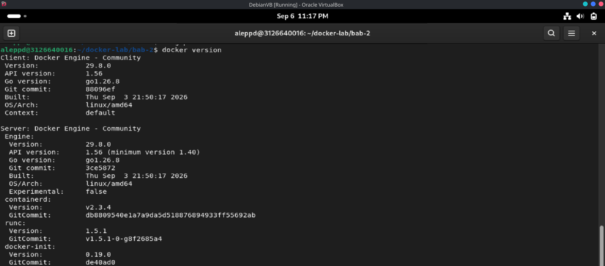
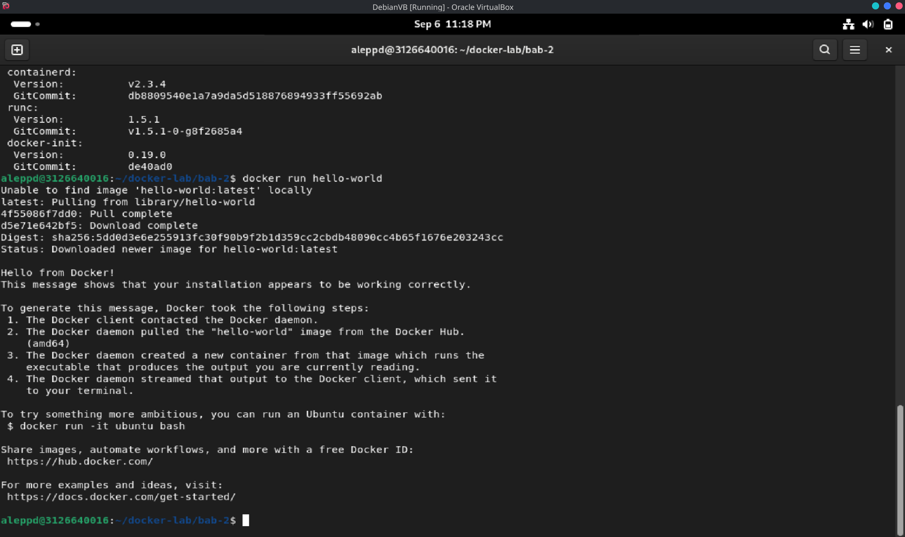
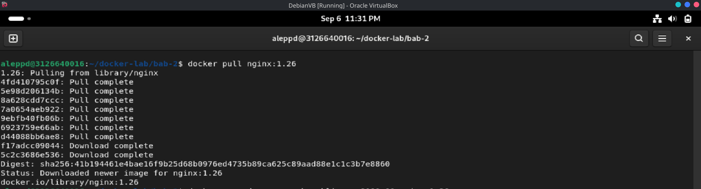
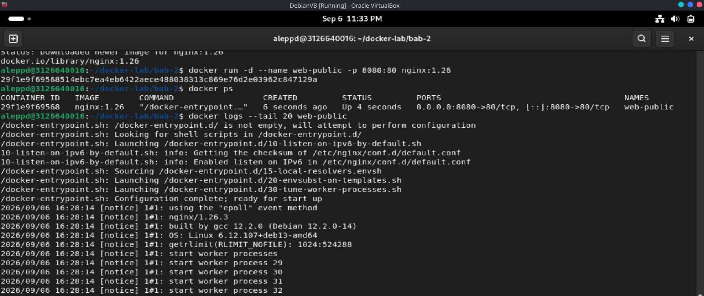
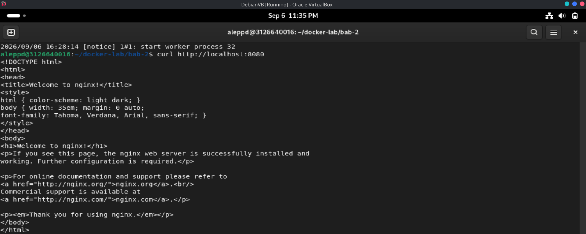
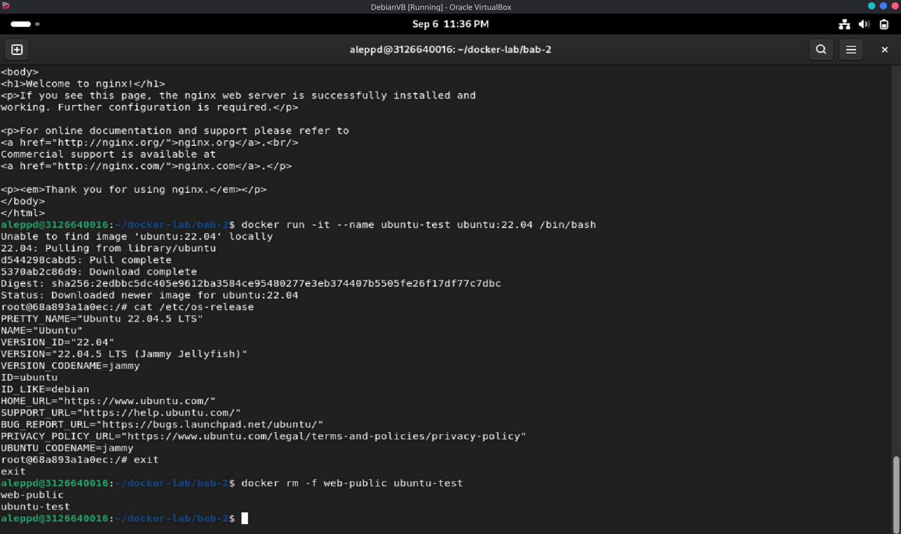
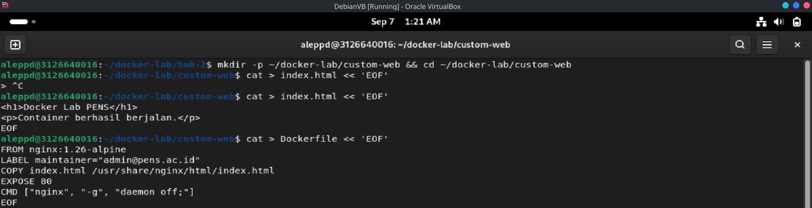
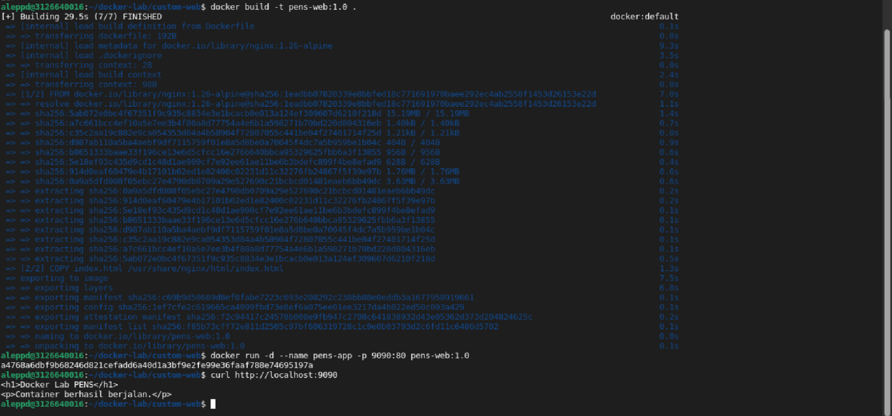

# LAPORAN PRAKTIKUM BAB 2
## Konsep Container dan Instalasi Docker

**Nama**: Ale Perdana Putra Darmawan  
**NIM**: 3126640016  
**Kelas**: STr LJ A  
**Tanggal pelaksanaan**: 12 September 2026

> **Disclaimer penggunaan AI.** Laporan praktikum ini disusun dengan bantuan kecerdasan buatan (AI) yang difungsikan sebagai alat dokumentasi. AI digunakan untuk merapikan catatan praktikum, menyusun struktur dan alur penulisan laporan, serta menyunting tata bahasa. Seluruh pelaksanaan praktikum, pengambilan bukti berupa screenshot, verifikasi keluaran perintah, dan pengambilan kesimpulan tetap dilakukan secara mandiri oleh saya.

## 1. Tujuan Praktikum

1. Menjelaskan perbedaan virtual machine dan container dari sisi isolasi, ukuran, startup time, dan overhead.
2. Mengidentifikasi komponen Docker: client, daemon, registry, image, container, network, dan volume.
3. Menginstal Docker Engine serta menjalankan container pertama, melakukan inspeksi image, melihat log, dan membangun image custom sederhana.
4. Memahami konfigurasi jaringan dan penyimpanan container beserta implikasi keamanannya.

## 2. Dasar Teori Singkat

**Containerisasi** adalah mekanisme isolasi proses berbasis fitur kernel Linux. Container membungkus aplikasi beserta dependensinya sehingga dapat berjalan konsisten di berbagai lingkungan, tanpa menyertakan kernel sendiri seperti pada virtual machine.

**Perbedaan VM dan container.** Virtual machine menjalankan sistem operasi tamu lengkap di atas hypervisor sehingga isolasinya kuat namun berukuran besar dan lambat untuk start. Container berbagi kernel host, sehingga lebih ringan, berukuran kecil, dan memiliki startup time jauh lebih singkat, tetapi boundary isolasinya bergantung pada konfigurasi kernel dan runtime.

**Isolasi container** dibangun oleh dua fitur utama:

- **namespace** — membatasi apa yang dapat *dilihat* proses (PID, mount, network, IPC, UTS, user), sehingga container memiliki pandangan terpisah terhadap sistem.
- **cgroup** — membatasi dan menghitung *pemakaian resource* (CPU, memori, I/O), sehingga satu container tidak menghabiskan resource host.

**Image dan layer.** Image bersusun atas layer *read-only* yang saling berbagi (*copy-on-write*). Saat container dijalankan, lapisan tulis (*writable layer*) ditambahkan di atas image. Format image dan runtime mengikuti OCI (Open Container Initiative), sehingga image dapat dipakai lintas runtime yang kompatibel.

**Arsitektur Docker.** Docker CLI (client) mengirim perintah ke Docker daemon melalui API. Daemon mendelegasikan manajemen lifecycle tingkat tinggi kepada **containerd**, yang kemudian memerintahkan low-level runtime **runc** untuk membentuk isolasi sesuai OCI Runtime Specification. Image diambil dari **registry** (misalnya Docker Hub).

**Dockerfile** mendefinisikan cara membangun image melalui instruksi seperti `FROM`, `COPY`, `RUN`, `EXPOSE`, dan `CMD`. Instruksi `EXPOSE` hanya metadata dan tidak memublikasikan port; publikasi port dilakukan melalui opsi `-p` pada `docker run`.

**Implikasi keamanan.** Karena container berbagi kernel host, batas isolasi tidak sekuat VM. Akses ke daemon Docker dan keanggotaan grup `docker` secara praktis setara dengan akses root, sehingga attack surface daemon harus dibatasi ketat.

## 3. Alat dan Lingkungan

| Komponen | Hasil identifikasi |
| --- | --- |
| Host | Linux / Mesin Virtual Ubuntu (lingkungan khusus laboratorium) |
| Runtime container | Docker Engine dan Docker CLI |
| Runtime pendukung | containerd (high-level) dan runc (low-level) |
| Plugin | Buildx dan Compose |
| Image praktikum | `hello-world`, `nginx:1.26`, `ubuntu:22.04`, `nginx:1.26-alpine` |
| Alat verifikasi | curl dan browser |
| Terminal | Shell untuk eksekusi perintah |
| Direktori kerja | `~/docker-lab/bab-2` |

## 4. Langkah Praktikum

### 4.1 Menyiapkan Direktori Kerja

Gunakan satu direktori kerja per bab agar file konfigurasi, volume bind mount, dan laporan mudah dipisahkan.

```bash
mkdir -p ~/docker-lab/bab-2
cd ~/docker-lab/bab-2
```

### 4.2 Praktikum 1 — Instalasi Docker Engine Ubuntu

Langkah berikut dijalankan secara berurutan, lalu diverifikasi sebelum melanjutkan.

```bash
sudo apt update
sudo apt install -y ca-certificates curl gnupg lsb-release
sudo install -m 0755 -d /etc/apt/keyrings
curl -fsSL https://download.docker.com/linux/ubuntu/gpg | sudo gpg --dearmor -o /etc/apt/keyrings/docker.gpg
sudo chmod a+r /etc/apt/keyrings/docker.gpg
echo "deb [arch=$(dpkg --print-architecture) signed-by=/etc/apt/keyrings/docker.gpg] https://download.docker.com/linux/ubuntu $(lsb_release -cs) stable" | sudo tee /etc/apt/sources.list.d/docker.list > /dev/null
sudo apt update
sudo apt install -y docker-ce docker-ce-cli containerd.io docker-buildx-plugin docker-compose-plugin
sudo usermod -aG docker $USER
newgrp docker
docker version
```

Hasil:



*Gambar 1. Keluaran `docker version` menampilkan client dan server Docker Engine.*

```bash
docker run hello-world
```

Hasil:



*Gambar 2. Eksekusi image `hello-world` sebagai verifikasi instalasi.*

### 4.3 Praktikum 2 — Container Nginx dan Ubuntu Interaktif

```bash
docker pull nginx:1.26
```

Hasil:



*Gambar 3. Proses `docker pull nginx:1.26`.*

Menjalankan container web, kemudian memeriksa status dan log-nya:

```bash
docker run -d --name web-public -p 8080:80 nginx:1.26
docker ps
docker logs --tail 20 web-public
```

Hasil:



*Gambar 4. Container `web-public` berjalan dengan pemetaan port 8080 ke 80, beserta log eksekusi.*

Mengakses layanan dari host:

```bash
curl http://localhost:8080
```

Hasil:



*Gambar 5. Hasil `curl http://localhost:8080` menampilkan halaman default Nginx.*

Menguji shell interaktif pada container:

```bash
docker run -it --name ubuntu-test ubuntu:22.04 /bin/bash
cat /etc/os-release
exit
docker rm -f web-public ubuntu-test
```

Hasil:



*Gambar 6. Pemeriksaan `/etc/os-release` di dalam container `ubuntu:22.04`.*

### 4.4 Praktikum 3 — Dockerfile Custom Web Statis

```bash
mkdir -p ~/docker-lab/custom-web && cd ~/docker-lab/custom-web
cat > index.html << 'EOF'
<h1>Docker Lab PENS</h1>
<p>Container berhasil berjalan.</p>
EOF
cat > Dockerfile << 'EOF'
FROM nginx:1.26-alpine
LABEL maintainer="admin@pens.ac.id"
COPY index.html /usr/share/nginx/html/index.html
EXPOSE 80
CMD ["nginx", "-g", "daemon off;"]
EOF
```

Hasil:



*Gambar 7. Pembuatan `index.html` dan `Dockerfile` pada direktori `custom-web`.*

Melakukan build image dan menjalankan container hasil build:

```bash
docker build -t pens-web:1.0 .
docker run -d --name pens-app -p 9090:80 pens-web:1.0
curl http://localhost:9090
```

Hasil:



*Gambar 8. Proses build image `pens-web:1.0`, eksekusi container `pens-app`, dan hasil `curl http://localhost:9090`.*

## 5. Hasil Pengujian

### 5.1 Checklist Hasil

- [x] Docker Engine aktif dan `docker version` menampilkan Client serta Server.
- [x] User non-root dapat menjalankan `docker ps` tanpa `sudo`.
- [x] Container Nginx dapat diakses dari browser melalui port host.
- [x] Image `pens-web:1.0` berhasil dibangun dan dijalankan.
- [ ] Mahasiswa dapat menjelaskan perbedaan `EXPOSE` dan `-p`.

### 5.2 Ringkasan Hasil per Praktikum

| Praktikum | Hasil |
| --- | --- |
| Instalasi Docker Engine | Daemon Docker aktif dan dapat diakses pengguna biasa (non-root) tanpa `sudo`; image `hello-world` berhasil dieksekusi. |
| Container Nginx dan Ubuntu interaktif | Container `web-public` berjalan dengan pemetaan port 8080→80 dan dapat diakses melalui `curl`; shell interaktif `ubuntu:22.04` berhasil dijalankan. |
| Dockerfile custom web statis | Image `pens-web:1.0` terbentuk dari base `nginx:1.26-alpine` dan berjalan pada port 9090. |

### 5.3 Prinsip Troubleshooting

Mulai dari status container, baca logs, cek network, cek volume, lalu validasi konfigurasi. Jangan langsung menghapus volume sebelum memahami apakah data masih dibutuhkan.

```bash
docker compose ps
docker compose logs --tail 100
curl -v http://localhost:8080
docker network ls
docker volume ls
docker inspect <container-name>
```

## 6. Threat Statement

| Unsur | Isi |
| --- | --- |
| Aset | Image container aplikasi, source code, akses daemon Docker, dan kredensial registry |
| Aktor ancaman | Penyerang eksternal, pengguna lokal dengan akses terbatas, atau pihak dengan akses ke akun pengguna host |
| Jalur serangan | Base image yang rentan atau tidak tepercaya, tag `latest` yang berubah, container `--privileged`, bind mount ke filesystem host, dan penyalahgunaan keanggotaan grup `docker` |
| Dampak | Kompromi penuh host (setara root), penyebaran artefak berbahaya, dan kompromi layanan produksi |

**Threat statement:** Aset yang dilindungi adalah image container aplikasi, source code, akses ke daemon Docker, dan kredensial registry pada pipeline. Aktor ancaman dapat berupa penyerang eksternal maupun pengguna dengan akses terbatas pada host. Jalur serangan meliputi penggunaan base image yang rentan atau tidak tepercaya, ketergantungan pada tag `latest`, eksekusi container dengan `--privileged`, bind mount ke filesystem host, serta penyalahgunaan akses grup `docker`. Dampak yang mungkin terjadi adalah kompromi penuh host karena akses daemon setara root, penyebaran artefak berbahaya, dan kompromi layanan produksi.

## 7. Analisis

### 7.1 Masalah yang Muncul dan Cara Mendiagnosisnya

**Masalah:** Muncul pesan error `Permission denied` saat mencoba menjalankan perintah `docker ps` atau `docker run` tanpa `sudo`.

**Cara mendiagnosis:** Mengacu pada prinsip troubleshooting keamanan, masalah ini diperiksa dengan melihat konfigurasi grup sistem. Pesan tersebut menunjukkan pengguna saat ini belum memiliki akses ke soket Docker. Solusinya adalah memverifikasi keanggotaan pengguna dalam grup Docker (`groups $USER`), kemudian menjalankan `sudo usermod -aG docker $USER` dilanjutkan dengan `newgrp docker` agar sesi terminal diperbarui.

### 7.2 Risiko Keamanan atau Operasional yang Relevan

Risiko operasional dan keamanan tertinggi berkaitan dengan akses daemon dan lifecycle image. Keanggotaan di dalam grup `docker` secara praktis memberikan privilege yang setara dengan akses root di sistem host, sehingga jika akun pengguna diretas, host dapat dikompromi penuh. Selain itu, batas isolasi container tidak sekuat virtual machine karena container menggunakan kernel yang sama dengan host, sehingga attack surface daemon harus dibatasi ketat.

### 7.3 Rekomendasi Perbaikan untuk Production-like Environment

Untuk lingkungan produksi, konfigurasi arsitektur container harus diperkeras (*hardened*). **Pertama**, gunakan *rootless mode* untuk memitigasi risiko daemon mengeksekusi proses sebagai root pada host. **Kedua**, gunakan tag digest yang definitif, bukan `latest`, serta terapkan *multi-stage build* untuk meminimalkan attack surface dan ukuran image. **Ketiga**, atur kuota memori dan CPU menggunakan konfigurasi cgroup (misalnya penambahan `--memory` atau `--cpus`) untuk mencegah satu container menghabiskan resource sistem secara penuh.

### 7.4 Evaluasi dan Latihan Mandiri

**1. Mengapa penggunaan tag `latest` tidak dianjurkan untuk deployment yang harus reproducible?**
Tag `latest` hanyalah label dinamis yang dapat berpindah untuk menunjuk ke versi baru kapan saja, sehingga pipeline atau lingkungan produksi mungkin menarik versi peranti lunak yang berbeda di hari yang berbeda. Reproducible deployment memerlukan pengikatan ke versi spesifik agar perubahan dapat dilacak secara eksplisit.

**2. Jelaskan peran containerd dan runc dalam arsitektur Docker.**
Daemon Docker mendelegasikan manajemen lifecycle kontainer tingkat tinggi kepada containerd. Selanjutnya, containerd memerintahkan low-level runtime runc untuk berinteraksi dengan kernel OS guna membentuk batas isolasi sesuai OCI Runtime Specification.

**3. Apa konsekuensi keamanan dari memasukkan user ke group `docker`?**
Keanggotaan grup `docker` memberikan kemampuan mengeksekusi perintah pada daemon Docker yang berjalan sebagai root, sehingga setara dengan hak root tanpa `sudo`. User tersebut dapat meluncurkan container `--privileged` atau melakukan bind mount pada filesystem host yang memungkinkan pengambilalihan sistem host secara menyeluruh.

**4. Bandingkan layer image `nginx:1.26-alpine` dan image custom yang Anda buat.**
`nginx:1.26-alpine` adalah base image yang berisi layer sistem operasi minimal Alpine dan instalasi Nginx standar. Image custom (`pens-web:1.0`) memuat seluruh layer base tersebut ditambah layer baru hasil instruksi `COPY` yang memasukkan `index.html` kustom ke direktori Nginx.

**5. Kapan sebaiknya memilih VM daripada container?**
Mesin Virtual dipilih apabila lingkungan membutuhkan isolasi infrastruktur dan boundary keamanan yang jauh lebih ketat melalui hypervisor, misalnya ketika menjalankan beban kerja dengan tingkat kepercayaan berbeda atau membutuhkan kernel terpisah.

## 8. Tindak Lanjut

### 8.1 Troubleshooting dan Analisis Hasil

| Gejala | Penyebab yang mungkin | Tindakan korektif |
| --- | --- | --- |
| Permission denied pada Docker socket | Akun belum memiliki akses ke soket Docker | Tambahkan pengguna ke grup `docker`, lalu perbarui sesi; jangan membuka permission socket ke semua pengguna |
| Image tidak dapat diunduh | Nama/tag image salah atau registry tidak terjangkau | Verifikasi nama dan tag image, lalu periksa konektivitas ke registry |
| Port sudah digunakan | Port host telah dipakai proses lain | Ubah pemetaan port host atau hentikan proses yang menempati port |
| Container langsung berhenti | Proses utama selesai atau gagal dijalankan | Periksa `docker logs <container>` dan pastikan `CMD` menjalankan proses long-running |

### 8.2 Tindak Lanjut

1. Melanjutkan ke Bab 3 untuk mempelajari network, volume, bind mount, tmpfs, dan Compose pada aplikasi multi-container.
2. Menerapkan `rootless mode`, pinning digest image, dan *multi-stage build* pada eksperimen berikutnya.
3. Menerapkan pembatasan resource (`--memory`, `--cpus`) serta opsi `:ro` pada volume agar tidak menulis ke host.
4. Menjalankan pemindaian image untuk memverifikasi base image yang digunakan pada container produksi.

## 9. Kesimpulan

1. Container adalah mekanisme isolasi proses berbasis kernel yang membungkus aplikasi bersama dependensinya; karena berbagi kernel host, container lebih ringan dan cepat dibanding virtual machine, tetapi boundary isolasinya perlu hardening tambahan.
2. Docker Engine berhasil diinstal dan daemon dapat diakses oleh pengguna non-root setelah keanggotaan grup `docker` diterapkan, dengan verifikasi melalui `docker version` dan eksekusi image `hello-world`.
3. Siklus hidup container berhasil didemonstrasikan melalui container Nginx dengan pemetaan port 8080 ke 80, pemeriksaan status via `docker ps`, pembacaan log, serta akses shell interaktif pada `ubuntu:22.04`.
4. Image custom `pens-web:1.0` berhasil dibangun dari base `nginx:1.26-alpine` dan dijalankan pada port 9090, menunjukkan bahwa instruksi `COPY` menambahkan layer baru di atas layer base image yang bersifat read-only.
5. Keanggotaan dalam grup `docker` setara dengan akses root pada host; untuk lingkungan produksi diperlukan rootless mode, penggunaan digest alih-alih `latest`, multi-stage build, serta pembatasan resource melalui cgroup.

## 10. Referensi

1. Ferry Astika Saputra, "Bab 2 — Konsep Container dan Instalasi Docker," repository DevSecOps PENS, `bab-02.md`: https://github.com/ferryas-pens/devsecops/blob/main/bab-02.md
2. Docker Documentation, *Docker Engine Installation*: https://docs.docker.com/engine/install/
3. Docker Documentation, *Docker Engine Security*: https://docs.docker.com/engine/security/
4. OCI, *Open Container Initiative Runtime Specification*: https://github.com/opencontainers/runtime-spec
