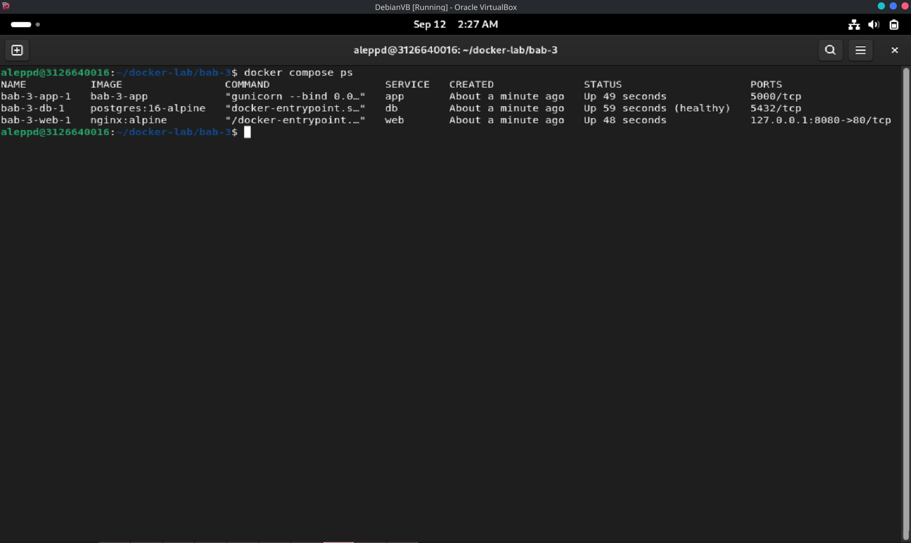
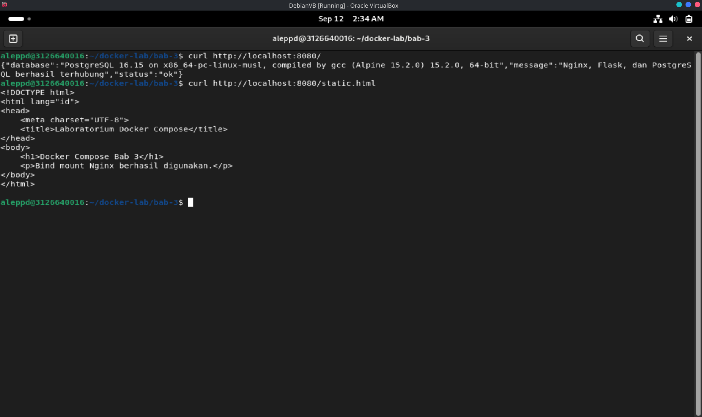
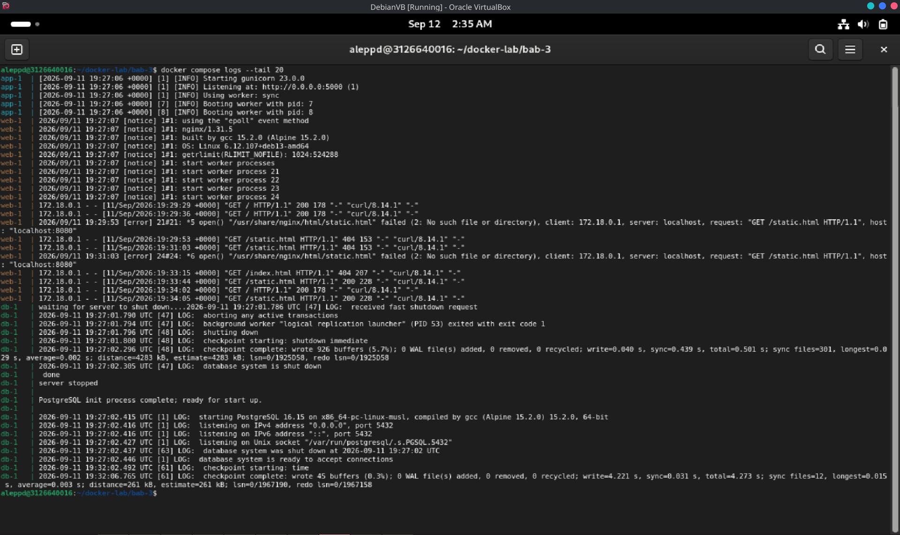

# LAPORAN PRAKTIKUM BAB 3
## Docker Network, Volume, Bind Mount, tmpfs, dan Compose

**Nama**: Ale Perdana Putra Darmawan  
**NIM**: 3126640016  
**Kelas**: STr LJ A  
**Tanggal pelaksanaan**: 12 September 2026

> **Disclaimer penggunaan AI.** Laporan praktikum ini disusun dengan bantuan kecerdasan buatan (AI) yang difungsikan sebagai alat dokumentasi. AI digunakan untuk merapikan catatan praktikum, menyusun struktur dan alur penulisan laporan, serta menyunting tata bahasa. Seluruh pelaksanaan praktikum, pengambilan bukti berupa screenshot, verifikasi keluaran perintah, dan pengambilan kesimpulan tetap dilakukan secara mandiri oleh saya.

## 1. Tujuan Praktikum

1. Membuat user-defined bridge network dan membuktikan resolusi nama antar container.
2. Membedakan volume, bind mount, dan tmpfs dari sisi persistensi, portabilitas, dan keamanan.
3. Menulis file Compose untuk aplikasi multi-container yang memiliki service, network, volume, dan healthcheck.
4. Mengelola lifecycle aplikasi dengan `docker compose up`, `ps`, `logs`, `stop`, `start`, `down`, dan `down -v`.

## 2. Dasar Teori Singkat

**Network sebagai graf keterjangkauan.** Jaringan container bukan sekadar pemberian alamat IP, melainkan pembentukan batas arsitektur: network `frontend` menghubungkan reverse proxy dengan aplikasi, sedangkan `backend` menghubungkan aplikasi dengan database. Database tidak perlu bergabung ke `frontend` dan umumnya tidak perlu memublikasikan port ke host.

**User-defined bridge dan DNS.** Default bridge cocok untuk eksperimen sederhana, sedangkan user-defined bridge menyediakan isolasi lebih baik dan resolusi DNS otomatis berdasarkan nama container atau nama service. Identitas logis ini lebih stabil daripada alamat IP yang dapat berubah ketika container dibuat ulang. Namun DNS internal bukan mekanisme autentikasi dan tidak mengenkripsi lalu lintas.

**Port publishing, NAT, dan firewall.** Port container hanya bermakna di dalam network namespace. Opsi `-p HOST_PORT:CONTAINER_PORT` membuat aturan pada host agar traffic diteruskan ke port container. Pemetaan `8080:80` berpotensi mengikat seluruh interface host, sedangkan `127.0.0.1:8080:80` membatasinya ke loopback. Instruksi `EXPOSE` pada image hanyalah metadata dan tidak membuat aturan publikasi.

**Lifecycle data dan pemilihan mount.**

| Mekanisme | Persistensi | Ketergantungan Host | Kasus Penggunaan | Risiko Utama |
| --- | --- | --- | --- | --- |
| Writable layer | Hilang saat container dihapus | Rendah | Data sementara kecil | Sulit di-backup; CoW overhead |
| Named volume | Melampaui lifecycle container | Rendah-sedang | Database dan data aplikasi | Salah hapus; backup/restore belum otomatis |
| Bind mount | Mengikuti file host | Tinggi | Source, konfigurasi, artefak dev | Container dapat mengubah host; path tidak portabel |
| tmpfs | Hilang saat stop/restart | Linux dan memori host | Cache atau data temporer sensitif | Konsumsi RAM; bukan penyimpanan tahan lama |
| Compose secret | Selama deployment; sumber eksternal tetap ada | Bergantung sumber file/env | Password, token, certificate | Proteksi sumber dan permission tetap wajib |

**Compose sebagai model deklaratif.** Compose menyatakan service, network, volume, configs, dan secrets dalam YAML. Compose Specification adalah format yang direkomendasikan. Perintah `docker compose config` menampilkan model akhir setelah interpolasi dan merge, sedangkan `docker compose up` merekonsiliasi keadaan aktual dengan model.

**Dependency, healthcheck, dan readiness.** `depends_on` mengatur urutan pembuatan dan penghentian service, tetapi service yang telah dimulai belum tentu siap menerima request. Compose dapat menunggu healthcheck dependency apabila `condition: service_healthy` digunakan.

**Konfigurasi, environment, dan secret.** Environment variable memisahkan konfigurasi dari image, tetapi berpotensi terlihat melalui inspect, process environment, log, atau crash report. Data sensitif sebaiknya ditempatkan pada secret yang diberikan hanya kepada service yang memerlukannya.

## 3. Alat dan Lingkungan

| Komponen | Hasil identifikasi |
| --- | --- |
| Host | Linux / Mesin Virtual Ubuntu (lingkungan khusus laboratorium) |
| Runtime dan orkestrasi | Docker Engine dan Docker Compose (plugin v2) |
| Image praktikum | `nginx:alpine`, `alpine:3.20`, `postgres:16-alpine`, `python:3.12-slim` |
| Dependensi aplikasi | Python Flask, psycopg, gunicorn |
| Berkas konfigurasi | `compose.yaml`, `nginx.conf`, `html/index.html` |
| Berkas aplikasi | `app/Dockerfile`, `app/requirements.txt`, `app/app.py` |
| Alat verifikasi | curl dan browser |
| Direktori kerja | `~/docker-lab/bab-3` |

## 4. Langkah Praktikum

### 4.1 Menyiapkan Direktori Kerja

```bash
mkdir -p ~/docker-lab/bab-3/{app,html}
cd ~/docker-lab/bab-3
```

```text
bab-3/
├── compose.yaml
├── nginx.conf
├── html/
│   └── index.html
└── app/
    ├── Dockerfile
    ├── requirements.txt
    └── app.py
```

### 4.2 Menulis Model Aplikasi pada `compose.yaml`

Model aplikasi tiga lapis dinyatakan secara deklaratif:

- `web` (`nginx:alpine`) — reverse proxy, port publikasi dibatasi ke loopback `127.0.0.1:8080:80`;
- `app` — Flask + gunicorn hasil build `./app`, berjalan sebagai user non-root (`USER appuser`);
- `db` (`postgres:16-alpine`) — healthcheck `pg_isready`, data pada named volume `pg-data`;
- bind mount `./html` dan `./nginx.conf` diberi opsi `:ro`;
- network terpisah: `frontend` (web–app) dan `backend` (app–db);
- `app` menunggu database dengan `condition: service_healthy`.

### 4.3 Validasi dan Menjalankan Stack

```bash
docker compose config --services
docker compose up -d --build
```

### 4.4 Menghentikan dan Membersihkan Lingkungan

```bash
docker compose down
```

Menghapus container dan network project, tetapi mempertahankan data PostgreSQL. Untuk menghapus container, network, sekaligus volume:

```bash
docker compose down -v
```

Perintah kedua bersifat destruktif karena data pada `pg-data` akan dihapus.

## 5. Hasil Pengujian

### 5.1 Status Service Berjalan

```bash
docker compose ps
```

Hasil:



*Gambar 1. `docker compose ps` menunjukkan service `web` dan `app` berstatus `Up` serta `db` berstatus `Up (healthy)`.*

### 5.2 Hasil Pengujian Endpoint

```bash
curl http://localhost:8080/
curl -i http://localhost:8080/health
curl http://localhost:8080/static.html
```

Keluaran yang diharapkan pada endpoint utama:

```json
{
  "database": "PostgreSQL 16...",
  "message": "Nginx, Flask, dan PostgreSQL berhasil terhubung",
  "status": "ok"
}
```

Hasil:



*Gambar 2. Endpoint `/` mengembalikan `status: ok` beserta versi PostgreSQL, dan `/health` mengembalikan HTTP 200 `healthy`.*

### 5.3 Cuplikan Log/Query yang Membuktikan Sistem Bekerja

```bash
docker compose logs --tail 100
docker compose logs app
docker compose logs db
```

Hasil:



*Gambar 3. Log menunjukkan request Nginx diteruskan ke gunicorn dan query `SELECT 1;` berhasil dijawab PostgreSQL.*

### 5.4 Prinsip Troubleshooting

Mulai dari status container, baca logs, cek network, cek volume, lalu validasi konfigurasi. Jangan langsung menghapus volume sebelum memahami apakah data masih dibutuhkan.

```bash
docker compose ps
docker compose logs --tail 100
curl -v http://localhost:8080
docker network ls
docker volume ls
docker inspect <container-name>
```

## 6. Threat Statement

| Unsur | Isi |
| --- | --- |
| Aset | Layanan aplikasi, data PostgreSQL pada `pg-data`, kredensial database, dan berkas konfigurasi |
| Aktor ancaman | Penyerang eksternal pada jaringan, maupun proses/aplikasi yang dikompromikan di dalam stack |
| Jalur serangan | Publikasi port ke seluruh interface host, bind mount dengan akses tulis, kredensial pada environment, dan perpindahan lateral melalui service yang terhubung ke dua network |
| Dampak | Eksposur layanan ke jaringan luar, modifikasi berkas host, kebocoran kredensial, kehilangan data akibat `down -v`, dan kompromi database |

**Threat statement:** Aset yang dilindungi adalah layanan aplikasi, data PostgreSQL pada named volume `pg-data`, kredensial database, dan berkas konfigurasi stack. Aktor ancaman dapat berupa penyerang eksternal pada jaringan maupun aplikasi yang dikompromikan di dalam stack. Jalur serangan meliputi publikasi port ke seluruh interface host, bind mount yang masih dapat menulis ke host, kredensial yang diletakkan pada `environment`, serta perpindahan lateral melalui service `app` yang terhubung ke `frontend` dan `backend`. Dampak yang mungkin terjadi adalah eksposur layanan ke jaringan luar, modifikasi berkas host, kebocoran kredensial, kehilangan data akibat `down -v`, dan kompromi database.

## 7. Analisis

### 7.1 Masalah yang Muncul dan Cara Mendiagnosisnya

**Masalah:** Nginx menampilkan `502 Bad Gateway` ketika endpoint aplikasi diakses, atau container `db` berstatus `unhealthy`.

**Cara mendiagnosis:** Sesuai prinsip troubleshooting, pemeriksaan dilakukan berlapis mulai dari status container, log, network, volume, lalu validasi konfigurasi. Langkah pertama adalah `docker compose ps` untuk melihat status service, kemudian `docker compose logs app` dan `docker compose logs db` untuk memastikan apakah aplikasi Flask gagal terhubung ke database. `502 Bad Gateway` menandakan Nginx tidak menemukan upstream yang sehat pada `app:5000`, umumnya karena aplikasi belum siap atau gagal berjalan. Container `db` yang `unhealthy` dapat disebabkan oleh password, nama database, atau healthcheck yang salah; apabila perubahan password tidak berlaku, penyebabnya adalah volume lama yang masih menyimpan database sebelumnya. Validasi akhir dilakukan dengan `docker compose config`, dan reset hanya dilakukan secara sadar melalui `docker compose down -v`.

### 7.2 Risiko Keamanan atau Operasional yang Relevan

Risiko utama pada bab ini adalah **perluasan attack surface akibat publikasi port dan mount yang terlalu permisif**. Konfigurasi `-p 8080:80` berpotensi mengikat seluruh interface host sehingga layanan dapat dijangkau dari jaringan eksternal, sedangkan `127.0.0.1:8080:80` membatasinya ke loopback. Bind mount memiliki akses tulis secara default sehingga proses container dapat mengubah atau menghapus berkas host, dan mount ke direktori container yang sudah berisi file akan menutupi isi tersebut selama mount aktif. Kredensial pada `environment` (`POSTGRES_PASSWORD`, `DB_PASS`) juga berpotensi terlihat melalui inspect, process environment, log, maupun crash report. Perlu ditegaskan bahwa network segmentation tidak menggantikan authorization: service `app` yang terhubung ke `frontend` dan `backend` merupakan jalur yang sah antara dua zona, sehingga bila aplikasi dikompromikan, penyerang dapat menggunakan jalur backend tersebut. Secara operasional, `docker compose down -v` bersifat destruktif karena menghapus volume `pg-data` yang menyimpan data PostgreSQL.

### 7.3 Rekomendasi Perbaikan untuk Production-like Environment

**Pertama**, terapkan prinsip least exposure: publikasikan hanya satu ingress yang diperlukan dan ikat ke alamat spesifik (`127.0.0.1:8080:80`), sementara database dan dashboard administratif tetap internal. **Kedua**, gunakan mount `:ro` bila write tidak diperlukan, pertimbangkan filesystem `read_only`, jalankan container sebagai user non-root (sudah diterapkan melalui `USER appuser`), dan batasi capability seminimal mungkin. **Ketiga**, pindahkan data sensitif dari `environment` ke Compose secret atau secret manager, batasi permission sumber secret, dan lakukan rotasi setelah penggunaan — password pada praktikum ini bersifat sintetis untuk lingkungan disposable dan tidak boleh dikomit ke repository. **Keempat**, pin image dengan digest atau tag versi spesifik, pertahankan pemisahan network `frontend`/`backend`, serta lengkapi dengan healthcheck yang bermakna, resource limit, dan logging. Terakhir, seluruh kontrol keamanan harus diuji pada model yang telah di-resolve dengan `docker compose config`, bukan hanya pada fragmen YAML.

### 7.4 Evaluasi dan Latihan Mandiri

**1. Mengapa user-defined bridge lebih baik daripada default bridge untuk multi-container app?**
User-defined bridge menyediakan isolasi antar project sekaligus resolusi DNS otomatis berdasarkan nama service, sehingga container dapat saling menemukan tanpa bergantung pada alamat IP yang berubah. Default bridge tidak memiliki DNS internal tersebut dan menempatkan semua container pada satu jaringan yang saling terlihat.

**2. Apa risiko bind mount terhadap keamanan host?**
Bind mount memberi proses di dalam container akses langsung ke berkas host dengan akses tulis secara default, sehingga container yang dikompromikan dapat mengubah atau menghapus berkas host. Path-nya juga tidak portabel dan dapat menutupi isi direktori container selama mount aktif.

**3. Apa perbedaan `docker compose down` dan `docker compose down -v`?**
`docker compose down` menghentikan lalu menghapus container dan network project tetapi mempertahankan volume data. Opsi `-v` ikut menghapus volume sehingga bersifat destruktif, misalnya menghilangkan isi `pg-data`.

**4. Kapan `depends_on` dengan healthcheck lebih tepat daripada `depends_on` biasa?**
`depends_on` biasa hanya menjamin urutan pembuatan container, bukan kesiapan service di dalamnya. `condition: service_healthy` lebih tepat ketika sebuah service bergantung pada kesiapan penuh, misalnya aplikasi yang harus menunggu database benar-benar menerima koneksi.

**5. Bagaimana strategi backup volume untuk database produksi?**
Backup dilakukan dengan menjalankan dump logis database (misalnya `pg_dump`) ke luar volume lalu menyimpannya di lokasi terpisah, bukan sekadar menyalin berkas volume. Prosedur restore harus diuji berkala karena named volume tidak memiliki backup otomatis.

## 8. Tindak Lanjut

1. Mengganti password pada `environment` dengan Compose secret atau secret manager sebelum stack digunakan di luar lingkungan disposable.
2. Menambahkan resource limit (`--memory`, `--cpus`), logging driver, dan filesystem `read_only` pada service yang mendukung.
3. Menguji prosedur backup dan restore `pg-data` secara berkala, karena named volume tidak otomatis memiliki backup.
4. Memindahkan stack ke orchestrator multi-node apabila kebutuhan ketersediaan, failover, dan rolling update melampaui kemampuan Compose satu host.
5. Melanjutkan ke bab berikutnya dengan menerapkan pinning digest image dan pemindaian kerentanan pada image yang digunakan.

## 9. Kesimpulan

1. Compose stack `web`–`app`–`db` berhasil berjalan dan terbukti terhubung end-to-end (Nginx → Flask → PostgreSQL) melalui `docker compose ps`, pengujian endpoint `curl`, dan cuplikan log.
2. User-defined bridge network menyediakan resolusi nama antar container, sehingga identitas service lebih stabil daripada alamat IP; namun DNS internal bukan mekanisme autentikasi maupun enkripsi.
3. Pembatasan publikasi port ke loopback, mount `:ro`, dan eksekusi aplikasi sebagai user non-root merupakan kontrol keamanan minimum yang diterapkan pada stack ini.
4. `depends_on` dengan `condition: service_healthy` memastikan service `app` menunggu database benar-benar siap, sedangkan `down -v` bersifat destruktif terhadap data volume.
5. Risiko utama bab ini adalah publikasi port yang terlalu luas, bind mount yang dapat menulis ke host, serta kredensial pada environment; untuk production-like diperlukan secret terkelola, least exposure, pemisahan network, dan pinning image.

## 10. Referensi

1. Ferry Astika Saputra, "Bab 3 — Docker Network, Volume, Bind Mount, tmpfs, dan Compose," repository DevSecOps PENS, `bab-03.md`: https://github.com/ferryas-pens/devsecops/blob/main/bab-03.md
2. Docker Documentation, *Networking Overview*: https://docs.docker.com/network/
3. Docker Documentation, *Volumes*: https://docs.docker.com/storage/volumes/
4. Docker Documentation, *Compose Specification*: https://docs.docker.com/compose/compose-file/
