# LAPORAN PRAKTIKUM BAB 4
## Nginx, Apache, Flask, dan TLS dengan Docker Compose

**Nama**: Ale Perdana Putra Darmawan  
**NIM**: 3126640016  
**Kelas**: STr LJ A  
**Tanggal pelaksanaan**: 3 Oktober 2026

> **Disclaimer penggunaan AI.** Laporan praktikum ini disusun dengan bantuan kecerdasan buatan (AI) yang difungsikan sebagai alat dokumentasi. AI digunakan untuk merapikan catatan praktikum, menyusun struktur dan alur penulisan laporan, serta menyunting tata bahasa. Seluruh pelaksanaan praktikum, pengambilan bukti berupa screenshot, verifikasi keluaran perintah, dan pengambilan kesimpulan tetap dilakukan secara mandiri oleh saya.

## 1. Tujuan Praktikum

1. Menjalankan Apache dan Nginx sebagai web server container dengan konfigurasi custom melalui Docker Compose.
2. Menggunakan Nginx sebagai reverse proxy ke backend service (Apache untuk konten statis dan Flask untuk API) dengan routing berbasis path dan header terpercaya.
3. Menerapkan sertifikat TLS self-signed untuk simulasi HTTPS pada reverse proxy.
4. Membaca access log dan error log web service dari bind mount pada host.
5. Membuktikan batas exposure: hanya reverse proxy yang memublikasikan port ke host, sedangkan backend tetap berada pada network internal.

## 2. Dasar Teori Singkat

### 2.1 Konsep Event-Driven

Event-driven adalah model arsitektur server di mana setiap request yang masuk diperlakukan sebagai *event*. Event tersebut ditempatkan pada antrian dan diproses oleh worker. Worker tidak memblokir proses ketika menunggu operasi I/O; ia dapat berpindah melayani event lain, lalu kembali saat event sebelumnya selesai. Model ini menjadi dasar arsitektur Nginx dan membuatnya lebih hemat memori dibanding model thread-per-request pada Apache.

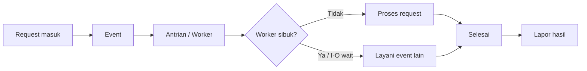
```mermaid
flowchart LR
  R[Request masuk] --> E[Event]
  E --> Q[Antrian / Worker]
  Q --> W{Worker sibuk?}
  W -->|Tidak| P[Proses request]
  W -->|Ya / I-O wait| L[Layani event lain]
  P --> D[Selesai]
  L --> D
  D --> N[Lapor hasil]
```

**Alur singkat:**

1. Request masuk dianggap sebagai *event*.
2. Event masuk ke antrian/worker (umumnya identik per CPU).
3. Worker tidak *blocking* — saat menunggu I/O, ia melayani event lain.
4. Setelah selesai, worker melaporkan hasil.
5. Berbeda dengan thread blocking yang harus menunggu satu request selesai.

---

### 2.2 Arsitektur Apache vs Nginx

Apache menggunakan model *process/thread per request*, sehingga setiap request membutuhkan proses atau thread tersendiri dan cenderung *blocking*. Nginx menggunakan model *event-driven asynchronous non-blocking*, sehingga satu worker dapat melayani banyak koneksi secara bersamaan. Perbedaan arsitektur inilah yang membuat Nginx lebih efisien untuk beban tinggi, sementara Apache tetap unggul pada kompatibilitas `.htaccess` dan modul tradisional.

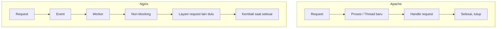
```mermaid
flowchart TB
  subgraph A[Apache]
    R1[Request] --> T1[Proses / Thread baru]
    T1 --> H1[Handle request]
    H1 --> F1[Selesai, tutup]
  end

  subgraph N[Nginx]
    R2[Request] --> E2[Event]
    E2 --> W2[Worker]
    W2 --> NB[Non-blocking]
    NB --> F2[Layani request lain dulu]
    F2 --> F2b[Kembali saat selesai]
  end
```

**Alur singkat:**

- **Apache:** proses/thread per request → blocking → siapkan, handle, tutup.
- **Nginx:** event-driven → non-blocking → worker dapat pindah ke request lain saat menunggu.
- Efek: Nginx lebih hemat memori dan cocok untuk reverse proxy serta static file.

---

### 2.3 Peta Konsep HTTP Routing & Trusted Header

Reverse proxy meneruskan request ke backend bersama header terpercaya seperti `X-Forwarded-For`, `X-Forwarded-Proto`, dan `Host`. Backend hanya boleh mempercayai header tersebut jika request benar-benar berasal dari proxy yang sah. Selain itu, proxy harus menormalisasi dan menyaring path agar tidak dapat dimanipulasi oleh penyerang melalui header palsu atau path traversal.

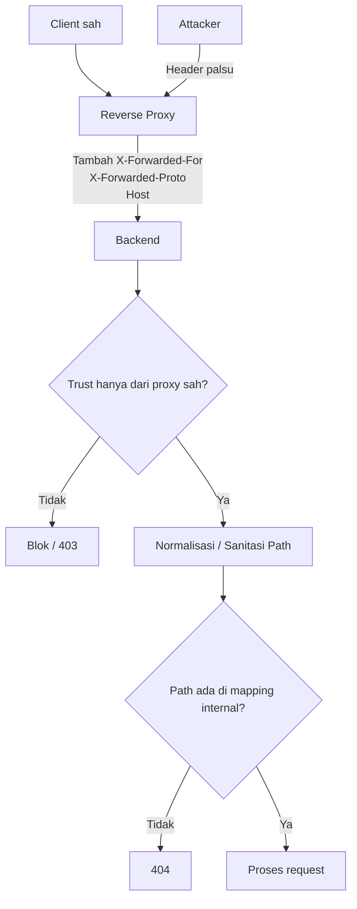
```mermaid
flowchart TD
  C[Client sah] --> P[Reverse Proxy]
  A[Attacker] -->|Header palsu| P

  P -->|Tambah X-Forwarded-For<br/>X-Forwarded-Proto<br/>Host| B[Backend]

  B --> T{Trust hanya dari proxy sah?}
  T -->|Tidak| X[Blok / 403]
  T -->|Ya| N[Normalisasi / Sanitasi Path]
  N --> M{Path ada di mapping internal?}
  M -->|Tidak| S404[404]
  M -->|Ya| OK[Proses request]
```

**Alur singkat:**

1. Client mengirim request ke proxy.
2. Proxy menambahkan header terpercaya.
3. Backend hanya mempercayai header dari proxy sah.
4. Proxy menormalisasi path sebelum diteruskan.
5. Path di luar mapping internal diblok atau diberi `404`.

---

### 2.4 Peta Konsep TLS Dua Opsi

TLS dapat diterapkan dengan dua pendekatan. Pada *TLS offloading*, TLS dihentikan di reverse proxy lalu trafik internal diteruskan sebagai HTTP biasa. Pada *end-to-end TLS*, enkripsi diteruskan hingga backend. Pilihan ini memengaruhi beban CPU, kebutuhan sertifikat, dan tingkat keamanan jalur internal.

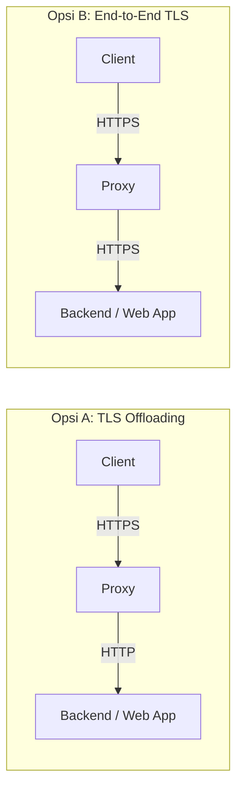
```mermaid
flowchart LR
  subgraph A[Opsi A: TLS Offloading]
    C1[Client] -->|HTTPS| P1[Proxy]
    P1 -->|HTTP| B1[Backend / Web App]
  end

  subgraph B[Opsi B: End-to-End TLS]
    C2[Client] -->|HTTPS| P2[Proxy]
    P2 -->|HTTPS| B2[Backend / Web App]
  end
```

**Alur singkat:**

- **Opsi A (offloading):** TLS dibuka di proxy, internal memakai HTTP.
- **Opsi B (end-to-end):** TLS diteruskan sampai backend.
- Pemilihan bergantung pada kebutuhan keamanan dan arsitektur.

---

### 2.5 Peta Konsep Penyimpanan Private Key

Private key tidak boleh dimasukkan ke dalam image kontainer atau repositori. Ia harus dipasang saat runtime melalui secret manager, Docker secret, atau volume mount dengan permission minimum. Private key juga memiliki siklus hidup yang harus dikelola: generate, renew, revoke, dan rotate.

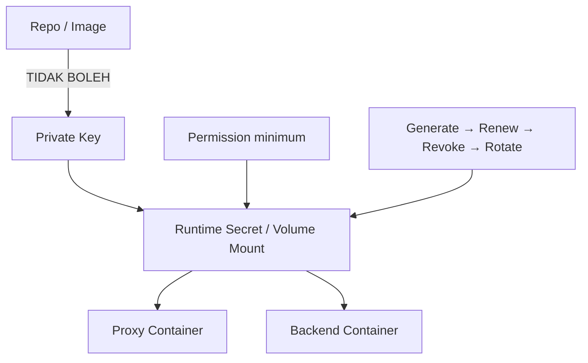
```mermaid
flowchart TD
  Repo[Repo / Image] -->|TIDAK BOLEH| PK[Private Key]
  PK --> S[Runtime Secret / Volume Mount]
  S --> P[Proxy Container]
  S --> B[Backend Container]
  Perm[Permission minimum] --> S
  Life[Generate → Renew → Revoke → Rotate] --> S
```

**Alur singkat:**

1. Private key tidak boleh masuk image atau repo.
2. Disimpan di runtime: Docker secret, volume mount, atau secret manager.
3. Dipasang dengan permission minimum.
4. Memiliki siklus hidup: generate → renew → revoke → rotate.
5. Hanya container yang membutuhkan yang boleh mengakses.

---

### 2.6 Peta Konsep Liveness vs Readiness

Liveness dan readiness adalah dua jenis health check dengan tujuan berbeda. Liveness memastikan container masih hidup; jika gagal, container akan di-restart. Readiness memastikan service siap menerima trafik; jika gagal, proxy akan mengembalikan `503 Service Unavailable`.

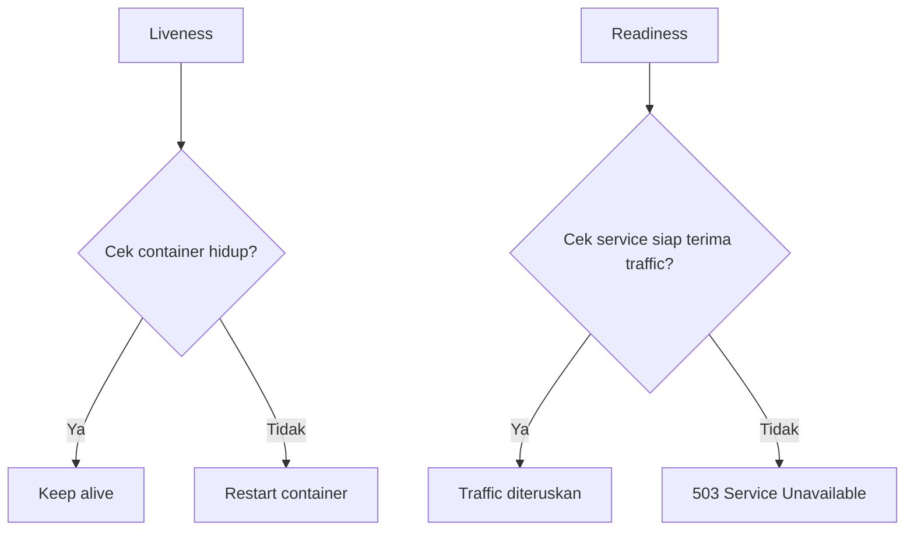
```mermaid
flowchart TD
  L[Liveness] --> LC{Cek container hidup?}
  LC -->|Ya| LK[Keep alive]
  LC -->|Tidak| LR[Restart container]

  R[Readiness] --> RC{Cek service siap terima traffic?}
  RC -->|Ya| RP[Traffic diteruskan]
  RC -->|Tidak| RS[503 Service Unavailable]
```

**Alur singkat:**

- **Liveness:** mengecek container hidup. Gagal → restart.
- **Readiness:** mengecek service siap menerima trafik. Gagal → `503`.
- Keduanya dipakai bersamaan agar trafik hanya masuk ke service yang benar-benar siap.

---

### 2.7 Peta Konsep Governance / Config as Code

Konfigurasi reverse proxy diperlakukan sebagai *code*: disimpan di repositori, memiliki versi, dan melalui tahapan pengujian sebelum dirilis. Tahapannya meliputi lint/syntax test, integration test, acceptance test, build image, regression test, hingga release dengan approval. Setiap tahap memiliki jalur rollback bila terjadi kegagalan.

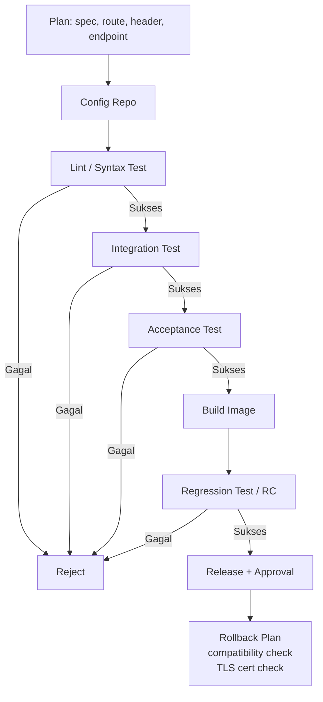
```mermaid
flowchart TD
  Plan[Plan: spec, route, header, endpoint] --> Repo[Config Repo]
  Repo --> Lint[Lint / Syntax Test]
  Lint -->|Gagal| Reject[Reject]
  Lint -->|Sukses| Integ[Integration Test]
  Integ -->|Gagal| Reject
  Integ -->|Sukses| Accept[Acceptance Test]
  Accept -->|Gagal| Reject
  Accept -->|Sukses| Image[Build Image]
  Image --> Reg[Regression Test / RC]
  Reg -->|Gagal| Reject
  Reg -->|Sukses| Release[Release + Approval]
  Release --> RB[Rollback Plan<br/>compatibility check<br/>TLS cert check]
```

## 3. Alat dan Lingkungan

| Komponen | Hasil identifikasi |
| --- | --- |
| Host | Linux / Mesin Virtual Ubuntu (lingkungan khusus laboratorium) |
| Runtime dan orkestrasi | Docker Engine dan Docker Compose (plugin v2) |
| Image praktikum | `nginx:alpine`, `httpd:2.4-alpine`, `python:3.12-slim` |
| Dependensi aplikasi | Flask dan Gunicorn (tercantum pada `app/requirements.txt`) |
| Berkas konfigurasi | `compose.yaml`, `nginx/conf/default.conf`, `apache/sites/index.html` |
| Berkas aplikasi | `app/Dockerfile`, `app/requirements.txt`, `app/app.py` |
| Sertifikat TLS | `certs/lab.crt` dan `certs/lab.key` (self-signed OpenSSL, RSA 2048, masa berlaku 365 hari) |
| Publikasi port | Hanya pada service `proxy`: `8080 → 80` (HTTP) dan `8443 → 443` (HTTPS) |
| Network | `web-net` (bridge) menghubungkan `proxy`, `apache-web`, dan `flask-app` |
| Log | `logs/nginx/access.log` dan `logs/nginx/error.log` (bind mount ke host) |
| Alat verifikasi | cURL, OpenSSL (`s_client`), dan browser |
| Direktori kerja | `~/docker-lab/bab-4` |

## 4. Langkah Praktikum

### 4.1 Direktori Kerja

Membuat struktur folder `bab-4` yang memisahkan konfigurasi Nginx, konten Apache, kode Flask, sertifikat, dan log. Fungsinya agar setiap komponen punya tempat sendiri dan mudah di-mount ke container.

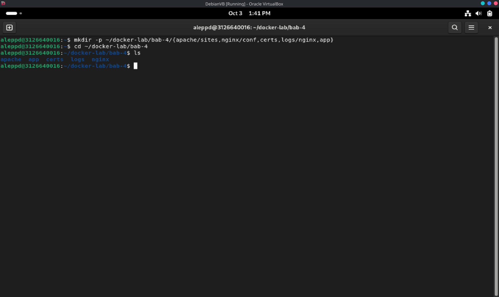

*Gambar 1. Struktur direktori `bab-4` berisi `app`, `apache`, `certs`, `compose.yaml`, `logs`, dan `nginx`.*

### 4.2 Sertifikat TLS Laboratorium

Membuat self-signed certificate dengan OpenSSL untuk localhost. Fungsinya agar Nginx bisa melayani HTTPS tanpa perlu CA publik, cukup untuk lab lokal.

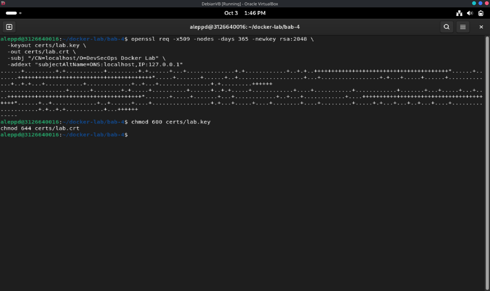

*Gambar 2. Detail sertifikat self-signed `certs/lab.crt` hasil pembuatan dengan OpenSSL.*

### 4.3 File compose.yaml

Mendefinisikan tiga service: proxy (Nginx), apache-web (Apache), dan flask-app (Flask + Gunicorn). Fungsinya mengatur port, volume, network internal, dependency, dan healthcheck Flask.

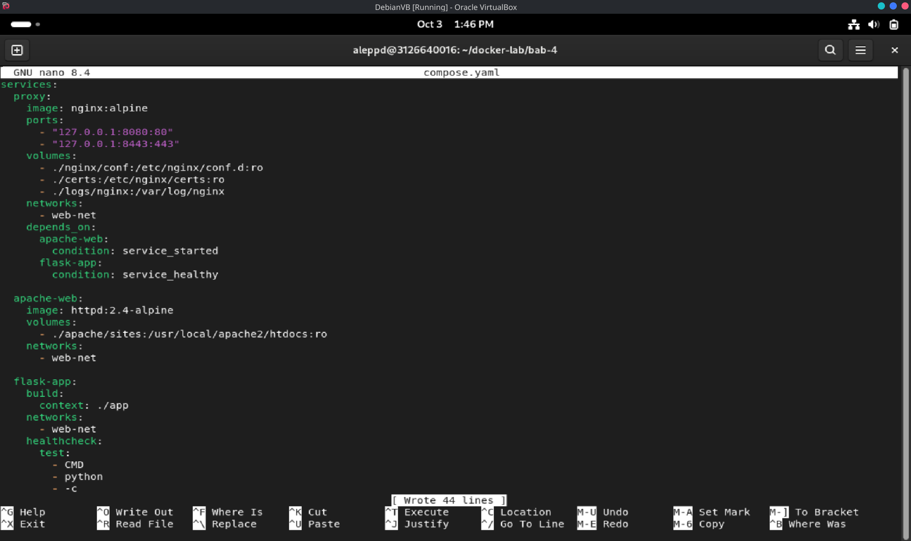

*Gambar 3. Penulisan `compose.yaml` yang mendefinisikan service `proxy`, `apache-web`, dan `flask-app`.*

### 4.4 File nginx/conf/default.conf

Konfigurasi reverse proxy Nginx: redirect HTTP→HTTPS, terminasi TLS, security header, dan routing `/` ke Apache serta `/api/` ke Flask. Fungsinya sebagai pintu masuk tunggal ke seluruh stack.

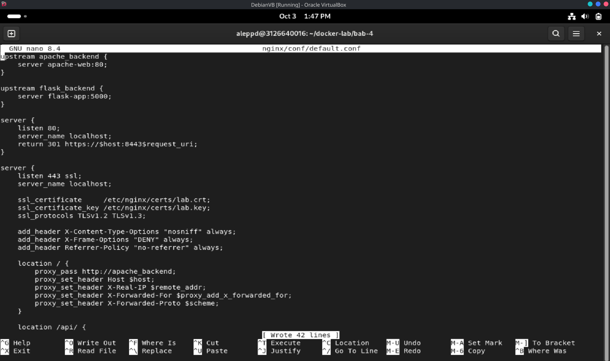

*Gambar 4. Penulisan `nginx/conf/default.conf` berisi redirect, terminasi TLS, dan routing ke Apache serta Flask.*

### 4.5 File apache/sites/index.html

Halaman statis yang dilayani Apache di belakang Nginx. Fungsinya sebagai konten uji untuk membuktikan reverse proxy ke Apache berjalan.

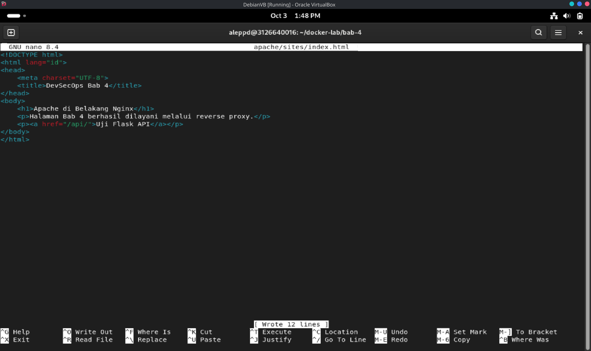

*Gambar 5. Penulisan `apache/sites/index.html` sebagai konten uji backend Apache.*

### 4.6 File app/requirements.txt

Mendefinisikan dependency Python: Flask dan Gunicorn. Fungsinya agar build image Flask reproducible.

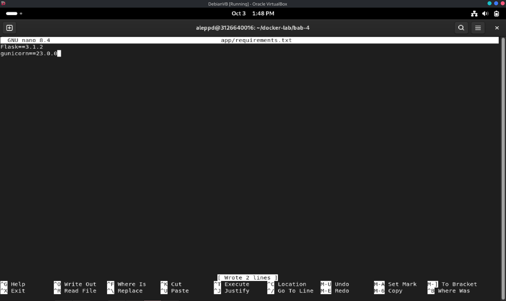

*Gambar 6. Penulisan `app/requirements.txt` yang memuat Flask dan Gunicorn.*

### 4.7 File app/app.py

Aplikasi Flask dengan endpoint `/` dan `/health`. Fungsinya sebagai backend API dan target healthcheck container.

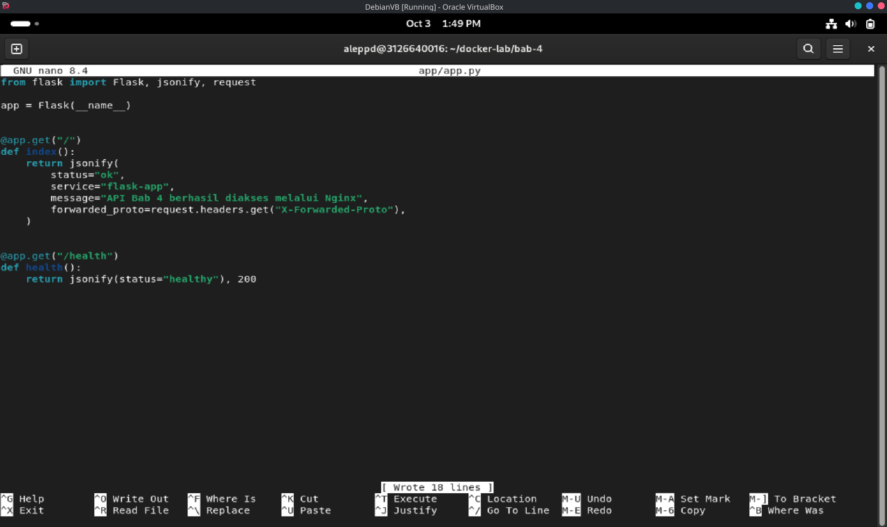

*Gambar 7. Penulisan `app/app.py` berisi endpoint `/` dan `/health`.*

### 4.8 File app/Dockerfile

Membangun image Flask dari `python:3.12-slim`, install dependency, buat user non-root, jalankan Gunicorn. Fungsinya agar container Flask berjalan aman dan siap produksi ringan.

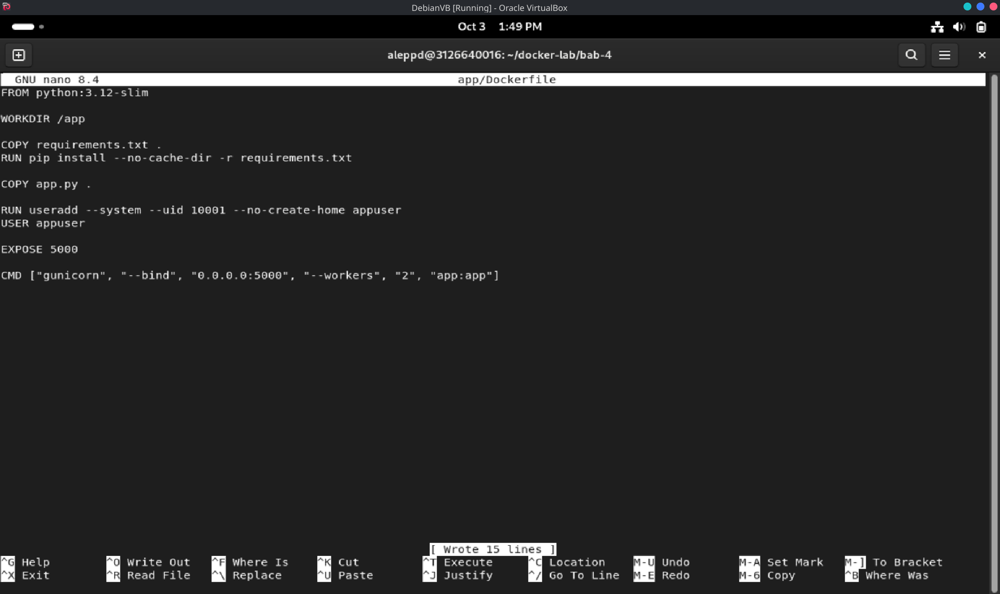

*Gambar 8. Penulisan `app/Dockerfile` dengan base image `python:3.12-slim` dan user non-root.*

### 4.9 Validasi

Memeriksa struktur file dan validitas `compose.yaml` sebelum dijalankan. Fungsinya mencegah error build/up karena konfigurasi salah.

| | |
| --- | --- |
| 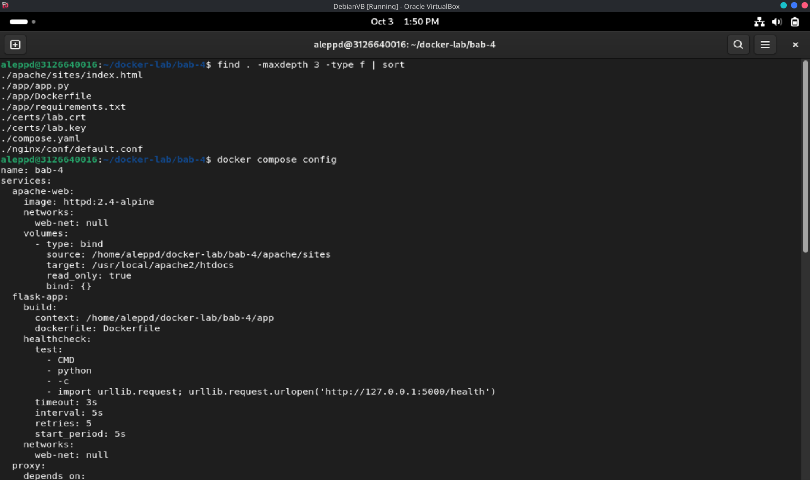 | 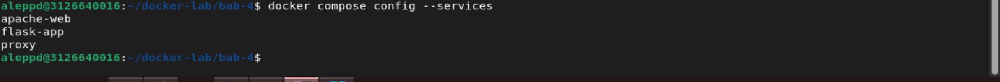 |
| *Gambar 9a. Pemeriksaan struktur file dengan `find . -maxdepth 3 -type f`.* | *Gambar 9b. Pemeriksaan validitas model dengan `docker compose config`.* |

### 4.10 Build dan Menjalankan Stack

Menjalankan seluruh stack dengan `docker compose up -d --build`. Fungsinya menyalakan proxy, Apache, dan Flask sekaligus dengan urutan dependency yang benar.

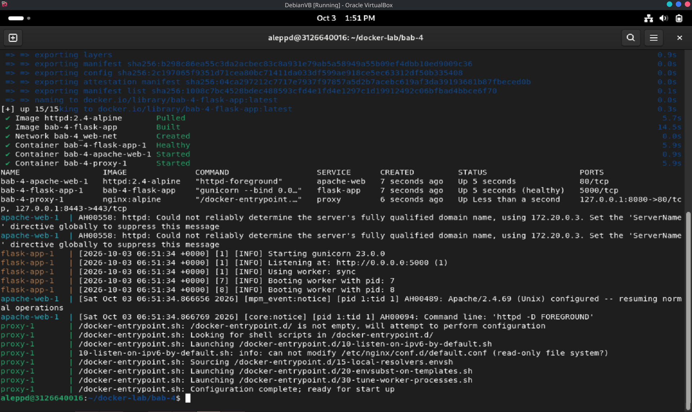

*Gambar 10. Status service pada `docker compose ps` beserta cuplikan log awal stack.*

### 4.11 Pengujian Cepat

Menguji redirect HTTP→HTTPS, halaman Apache, API Flask, health endpoint, dan negosiasi TLS. Fungsinya memverifikasi semua jalur routing dan TLS bekerja.

| | |
| --- | --- |
| 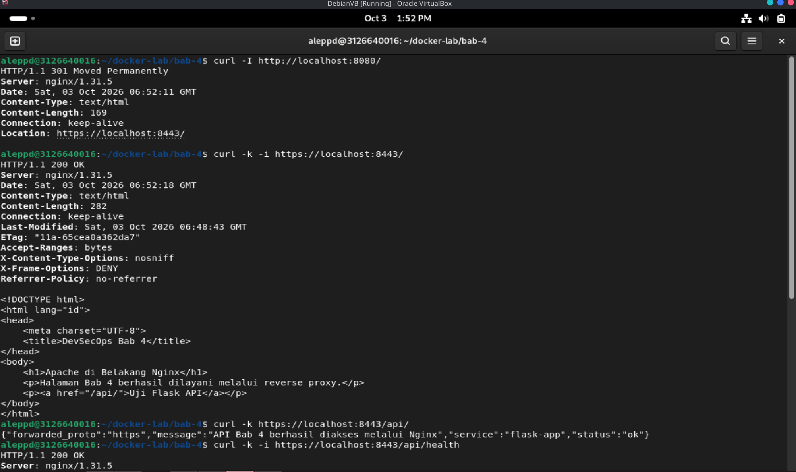 | 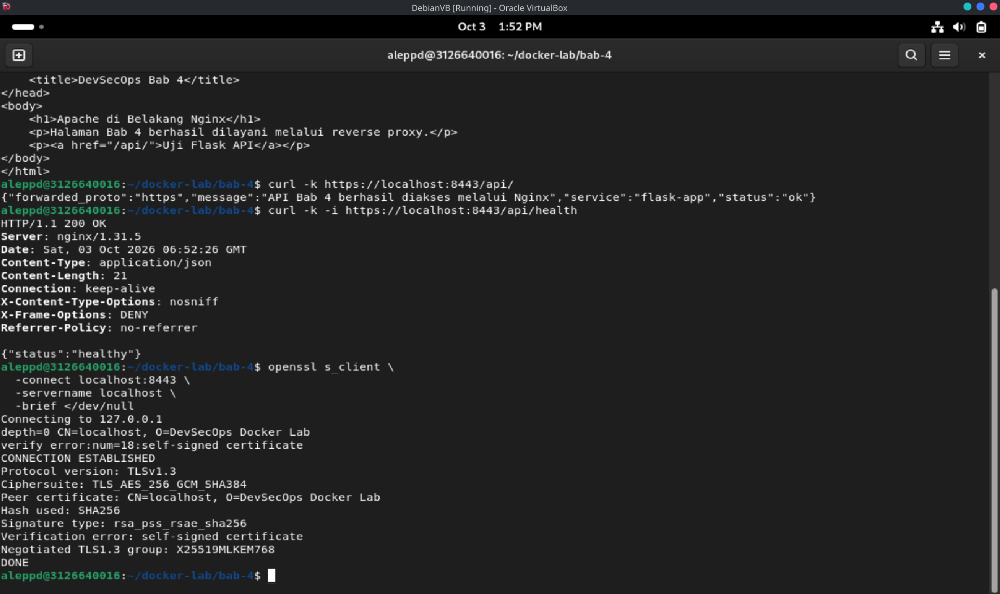 |
| *Gambar 11a. Uji redirect HTTP→HTTPS dan halaman Apache melalui Nginx.* | *Gambar 11b. Negosiasi TLS dengan `openssl s_client` pada port 8443.* |

### 4.12 Pemeriksaan Isolasi

Memastikan hanya proxy yang punya published port, sedangkan Apache dan Flask hanya bisa diakses dari internal network. Fungsinya membuktikan isolation boundary berjalan.

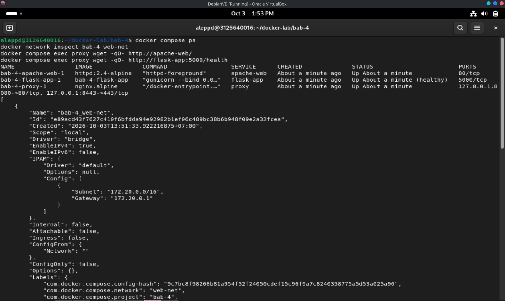

*Gambar 12. Hanya `proxy` yang memublikasikan port; akses internal ke Apache dan Flask diuji dengan `wget` dari dalam network.*

### 4.13 Log

Melihat log container dan access/error log Nginx. Fungsinya untuk audit, debugging, dan memastikan request tercatat.

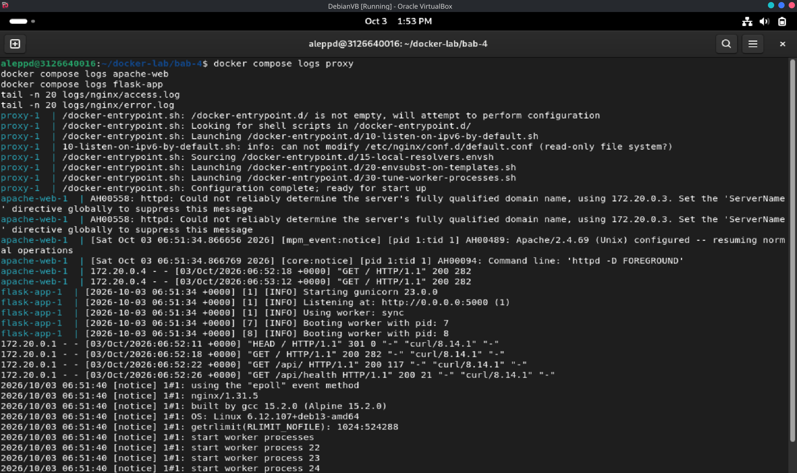

*Gambar 13. Log ketiga service serta access dan error log Nginx yang mencatat request.*

### 4.14 Cleanup

Menghentikan stack dan menghapus image lokal bila perlu. Fungsinya membersihkan environment setelah praktikum.

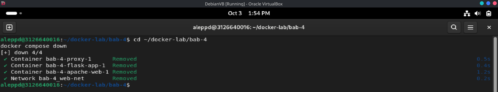

*Gambar 14. Proses `docker compose down` beserta opsi `--rmi local` untuk membersihkan image hasil build.*

## 5. Hasil Pengujian

### 5.1 Status Service dan Log Awal

```bash
docker compose ps
docker compose logs --tail 100
```

Hasil: ketiga service `proxy`, `apache-web`, dan `flask-app` berjalan; `flask-app` berstatus `healthy` sesuai healthcheck, dan cuplikan log awal stack tercatat tanpa galat fatal. Rincian terlihat pada Gambar 10 (bagian 4.10).

### 5.2 Hasil Pengujian Endpoint dan TLS

```bash
curl -I http://localhost:8080/
curl -k -i https://localhost:8443/
curl -k https://localhost:8443/api/
curl -k -i https://localhost:8443/api/health
openssl s_client -connect localhost:8443 -servername localhost -brief </dev/null
```

`curl -k` hanya digunakan untuk sertifikat self-signed laboratorium.

| Pemeriksaan | Hasil | Bukti |
| --- | --- | --- |
| Redirect HTTP → HTTPS | `curl -I http://localhost:8080/` menghasilkan `301` menuju `https://localhost:8443` | Gambar 11a |
| Halaman Apache melalui Nginx | `curl -k -i https://localhost:8443/` menampilkan konten `apache/sites/index.html` | Gambar 11a |
| API Flask melalui `/api/` | Endpoint mengembalikan JSON dari Flask | Bagian 4.11 |
| Health endpoint Flask | `/api/health` menjawab `healthy` | Bagian 4.11 |
| Negosiasi TLS | Handshake dengan `openssl s_client` berhasil pada port 8443 (konfigurasi `ssl_protocols TLSv1.2 TLSv1.3`) | Gambar 11b |

### 5.3 Pemeriksaan Isolasi dan Logging

```bash
docker network inspect bab-4_web-net
docker compose exec proxy wget -qO- http://apache-web/
docker compose exec proxy wget -qO- http://flask-app:5000/health
tail -n 20 logs/nginx/access.log
tail -n 20 logs/nginx/error.log
```

Hasil: hanya `proxy` yang memiliki published port; `apache-web` dan `flask-app` hanya dapat dijangkau dari dalam `web-net` (terbukti dengan `wget` internal). Request uji tercatat pada access dan error log Nginx di host. Rincian pada Gambar 12 dan Gambar 13 (bagian 4.12 dan 4.13).

### 5.4 Checklist Hasil

- [x] `docker compose config` valid tanpa galat dan ketiga service didefinisikan.
- [x] Nginx reverse proxy mengakses Apache melalui nama service `apache-web`.
- [x] Endpoint `/api/` diarahkan ke backend Flask.
- [x] HTTPS self-signed berjalan di port 8443.
- [x] `flask-app` berstatus `healthy` pada healthcheck.
- [x] Access dan error log tersimpan pada direktori host.
- [x] Hanya `proxy` yang memublikasikan port; isolasi network terbukti.

### 5.5 Prinsip Troubleshooting

Mulai dari status container, baca logs, cek network, cek volume, lalu validasi konfigurasi. Jangan langsung menghapus volume sebelum memahami apakah data masih dibutuhkan.

```bash
docker compose ps
docker compose logs --tail 100
curl -v http://localhost:8080
docker network ls
docker volume ls
docker inspect <container-name>
```

## 6. Threat Statement

| Unsur | Isi |
| --- | --- |
| Aset | Konfigurasi reverse proxy (`nginx/conf/default.conf`), sertifikat dan private key TLS (`certs/lab.crt`, `certs/lab.key`), konten situs Apache, aplikasi Flask, log Nginx pada `logs/nginx`, serta source code stack |
| Aktor ancaman | Penyerang eksternal yang menjangkau port host, pengguna lokal yang tidak berwenang pada host atau repository, pihak yang memperoleh akses ke bind mount berisi private key, serta client yang mengirim header atau path palsu |
| Jalur serangan | Pencurian atau commit tidak sengaja terhadap private key; akses backend langsung yang melewati proxy; pemalsuan header `X-Forwarded-*`; routing dan normalisasi path yang longgar; TLS self-signed dengan protokol/cipher usang; absennya rate limiting dan timeout eksplisit; healthcheck yang hanya ada pada Flask |
| Dampak | Kompromi kerahasiaan dan identitas TLS (pencurian trafik, impersonasi server), manipulasi audit log serta keputusan berbasis header, akses tidak sah ke backend internal, kegagalan layanan akibat resource exhaustion, dan kesulitan forensik karena log belum UTC serta belum terstruktur |

**Threat statement:** Aset yang dilindungi adalah konfigurasi reverse proxy, pasangan sertifikat dan private key TLS, konten situs, aplikasi Flask, log Nginx, serta source code stack. Aktor ancaman dapat berupa penyerang eksternal yang menjangkau port host, pengguna lokal yang tidak berwenang, maupun pihak yang memperoleh akses ke bind mount tempat private key disimpan. Jalur serangan meliputi pencurian private key, akses backend langsung yang melewati proxy, pemalsuan forwarded header, kelemahan normalisasi path, penggunaan TLS self-signed dengan cipher usang, serta ketiadaan rate limiting dan timeout yang mengekspos layanan pada DoS/Slowloris. Dampak yang mungkin terjadi adalah kebocoran trafik dan impersonasi server, manipulasi audit log dan keputusan keamanan, akses tidak sah ke backend, kegagalan layanan, serta buruknya ketelusuran insiden.

## 7. Analisis

### 7.1 Masalah yang Muncul dan Cara Mendiagnosisnya

Dalam percobaan bab 4 ini, saya tidak menemukan masalah saat mencoba praktikum.

### 7.2 Risiko Keamanan atau Operasional yang Relevan

- Self-signed certificate → tidak cocok untuk production, browser akan warning, tidak ada validasi CA.
- Private key tersimpan di folder lokal (`certs/lab.key`) → di production harus pakai secret manager, bukan volume biasa.
- Tidak ada rate limiting di Nginx → rentan DoS/Slowloris.
- Tidak ada timeout eksplisit di `proxy_pass` → bisa memicu 504 atau koneksi menggantung.
- Security header minim → belum ada HSTS, CSP, dan X-XSS-Protection.
- Healthcheck hanya di Flask → Apache dan Nginx belum punya readiness/liveness eksplisit.
- Log belum UTC dan belum terstruktur → sulit untuk forensik.
- Tidak ada versioning config → perubahan `default.conf` tidak terlacak.

### 7.3 Rekomendasi Perbaikan untuk Production-like Environment

1. **TLS:** gunakan sertifikat dari CA sah (Let's Encrypt) atau internal PKI, aktifkan HSTS, TLS 1.3 only bila memungkinkan.
2. **Private key:** pindahkan ke Docker secret / Vault / secret manager, permission minimum, rotasi berkala.
3. **Isolasi:** pertahankan internal network, jangan publish port Apache/Flask, gunakan `internal: true` pada network internal.
4. **Reverse proxy hardening:**
   - Tambah `limit_req`, `limit_conn`.
   - Set `proxy_read_timeout`, `proxy_connect_timeout`, `client_body_timeout` yang sinkron dengan backend.
   - Tambah CSP, HSTS, X-XSS-Protection.
5. **Monitoring:**
   - Liveness & readiness untuk semua service.
   - Healthcheck Apache dan Nginx.
   - Log terstruktur (JSON), timestamp UTC, kirim ke centralized logging.
6. **Governance:**
   - Perlakukan `default.conf` dan `compose.yaml` sebagai code → masuk Git, versioning, lint, integration test.
   - Rollback plan: cek kompatibilitas konfigurasi dan sertifikat.
7. **Image:**
   - Pin versi image (`nginx:1.27-alpine`, `httpd:2.4.62-alpine`).
   - Scan image (Trivy/Grype).
   - Jalankan sebagai non-root (sudah diterapkan di Flask).
8. **Resource limit:**
   - Tambah `mem_limit`, `cpus`, dan `restart: unless-stopped`.
9. **Secrets & environment:**
   - Jangan hardcode kredensial; pakai `.env` atau secret.
10. **Testing:**
    - Tambah acceptance test dan regression test sebelum rilis.

### 7.4 Evaluasi dan Latihan Mandiri

**1. Mengapa reverse proxy tidak seharusnya menjalankan semua logic aplikasi?**
Reverse proxy sebaiknya hanya menangani tugas lalu lintas seperti terminasi TLS, routing, dan normalisasi path, bukan logika bisnis. Menempatkan seluruh logic di proxy menjadikannya titik kegagalan tunggal dan menyulitkan pemisahan tanggung jawab serta penskalaan backend.

**2. Apa perbedaan TLS termination dan end-to-end TLS?**
Pada TLS termination, enkripsi berhenti di reverse proxy dan trafik ke backend diteruskan sebagai HTTP biasa, sedangkan pada end-to-end TLS enkripsi tetap dipertahankan hingga backend. End-to-end lebih aman untuk jalur internal tetapi menambah beban sertifikat dan kompleksitas pengelolaan.

**3. Bagaimana cara mengisolasi backend agar tidak langsung diakses dari host?**
Backend ditempatkan pada network internal dan port-nya tidak dipublikasikan ke host, sehingga hanya dapat dijangkau melalui reverse proxy di dalam network yang sama. Network juga dapat ditandai `internal: true` bila backend tidak perlu keluar ke jaringan luar.

**4. Apa konsekuensi menyimpan private key TLS di bind mount?**
Private key pada bind mount mudah dibaca proses lain di host dan berisiko ikut ter-commit ke repositori, sehingga kerahasiaan identitas TLS dapat bocor. Praktik yang lebih aman adalah menyimpannya sebagai Docker secret atau di secret manager dengan permission minimum dan rotasi berkala.

**5. Bandingkan log Nginx dan log Apache dari sisi format dan kegunaan debugging.**
Log Nginx ringkas dan terstruktur sehingga cocok untuk audit lalu lintas serta analisis pola akses, sedangkan log Apache lebih modular dan rinci lewat pemisahan access dan error log per modul. Untuk debugging, log Apache lebih membantu menelusuri masalah modul, sementara log Nginx lebih ringkas untuk memantau request dan status.

## 8. Tindak Lanjut

1. Menambahkan healthcheck liveness dan readiness untuk `apache-web` dan `proxy` (saat ini baru `flask-app` yang di-healthcheck), mengikuti pemisahan konsep pada bagian 2.6.
2. Menyimpan `compose.yaml` dan `nginx/conf/default.conf` ke repository Git beserta uji sintaks dan acceptance test agar alur config as code pada bagian 2.7 mulai berjalan.
3. Menguji opsi end-to-end TLS dari bagian 2.4 dengan memasang sertifikat pada backend, lalu membandingkan beban CPU dan kompleksitas sertifikat terhadap TLS offloading.
4. Memindahkan `certs/lab.key` dari bind mount ke Docker secret atau secret manager dengan rotasi berkala, serta menyiapkan penggantian sertifikat self-signed menggunakan ACME/Let's Encrypt untuk staging.
5. Melengkapi `default.conf` dengan rate limiting, timeout eksplisit, serta header HSTS dan CSP, kemudian mengulang seluruh pengujian pada bagian 5.
6. Melanjutkan ke bab berikutnya dengan menerapkan pinning versi image, pemindaian kerentanan (Trivy/Grype), dan prosedur rollback yang telah diuji.

## 9. Kesimpulan

1. Stack tiga service (Nginx → Apache untuk konten statis, Nginx → Flask untuk API) berhasil dibangun dengan Docker Compose dan terverifikasi end-to-end melalui redirect HTTP→HTTPS, halaman Apache, API Flask, health endpoint, negosiasi TLS, pemeriksaan isolasi, dan cuplikan log.
2. Hanya service `proxy` yang memublikasikan port ke host, sedangkan `apache-web` dan `flask-app` hanya terjangkau dari internal `web-net`, sehingga pola least exposure pada reverse proxy terbukti berjalan.
3. TLS self-signed memadai untuk laboratorium tetapi tidak untuk produksi; private key harus dikelola sebagai secret dengan siklus hidup generate → renew → revoke → rotate, bukan sebagai berkas pada bind mount atau repository.
4. Perbedaan arsitektur event-driven Nginx dan thread-per-request Apache menjadikan Nginx pilihan yang lebih hemat memori untuk reverse proxy berbeban tinggi, sementara pemisahan liveness dan readiness diperlukan agar trafik hanya masuk ke service yang benar-benar siap.
5. Praktikum ini masih memiliki celah berupa healthcheck yang baru ada pada Flask, absennya rate limiting dan timeout eksplisit, security header yang minimal, serta log yang belum UTC dan belum terstruktur; ke depan konfigurasi harus diperlakukan sebagai code dengan versioning, pengujian, dan rollback plan.

## 10. Referensi

1. Ferry Astika Saputra, "Bab 4 — Web Service Container: Apache, Nginx, Reverse Proxy, dan TLS," repository DevSecOps PENS, `bab-04.md`: https://github.com/ferryas-pens/devsecops/blob/main/bab-04.md
2. Rekaman video materi Bab 4 (teori tambahan: konsep event-driven, arsitektur Apache vs Nginx, routing dan trusted header, opsi TLS, penyimpanan private key, liveness vs readiness, serta config as code).
3. Docker Documentation, *Compose Specification*: https://docs.docker.com/compose/compose-file/
4. Docker Documentation, *Networking Overview*: https://docs.docker.com/network/
5. NGINX Documentation, *Reverse Proxy*: https://docs.nginx.com/nginx/admin-guide/web-server/reverse-proxy/
6. NGINX Documentation, *Configuring HTTPS Servers*: https://nginx.org/en/docs/http/configuring_https_servers.html