# LAPORAN PRAKTIKUM BAB 5
## Database Service di Docker: PostgreSQL

**Nama**: Ale Perdana Putra Darmawan  
**NIM**: 3126640016  
**Kelas**: STr LJ A  
**Tanggal pelaksanaan**: 9 Oktober 2026

> **Disclaimer penggunaan AI.** Laporan praktikum ini disusun dengan bantuan kecerdasan buatan (AI) yang difungsikan sebagai alat dokumentasi. AI digunakan untuk merapikan catatan praktikum, menyusun struktur dan alur penulisan laporan, serta menyunting tata bahasa. Seluruh pelaksanaan praktikum, pengambilan bukti berupa screenshot, verifikasi keluaran perintah, dan pengambilan kesimpulan tetap dilakukan secara mandiri oleh saya.

## 1. Tujuan Praktikum

1. Menjalankan PostgreSQL dengan konfigurasi berbasis environment variable dan volume persisten.
2. Menginisialisasi database menggunakan file SQL pada `docker-entrypoint-initdb.d`.
3. Mengakses database melalui `psql` dan pgAdmin4.
4. Melakukan backup dan restore menggunakan `pg_dump` dan `pg_restore`.
5. Menerapkan healthcheck pada service PostgreSQL dan memverifikasi kesiapan sebelum service lain bergantung padanya.

## 2. Dasar Teori Singkat

**Database sebagai sistem persisten.** Database container berbeda dari stateless service. Data harus diperlakukan sebagai aset utama, sehingga volume, backup, restore, permission, dan lifecycle container dirancang dengan hati-hati. PostgreSQL di dalam container tetap merupakan sistem relasional penuh; container hanya mengubah cara proses dan dependensinya dikemas. Data tidak boleh dianggap melekat pada umur container, karena writable layer akan hilang ketika container dihapus. Named volume dipasang kembali ketika container diganti, tetapi volume tetap bukan backup.

**Init script dan perilaku volume.** Image PostgreSQL resmi mengeksekusi berkas `.sql` dan `.sh` di `/docker-entrypoint-initdb.d` hanya ketika direktori data masih kosong. Ini sumber kebingungan yang umum: mengubah init script tidak berpengaruh bila volume lama masih dipakai, karena entrypoint menganggap cluster sudah terinisialisasi. Karena hanya berjalan sekali, perubahan skema berikutnya harus melalui mekanisme migrasi, bukan dengan mengedit berkas init.

**Transaksi, integritas, dan konkurensi.** Model ACID menjelaskan properti transaksi: atomicity membuat seluruh perubahan berhasil atau dibatalkan sebagai satu unit, consistency menjaga aturan integritas, isolation mengatur interaksi transaksi serentak, dan durability mempertahankan commit setelah kegagalan. Constraint seperti primary key, unique, dan not-null bukan sekadar dokumentasi, melainkan kontrol yang menolak state tidak valid meskipun aplikasi memiliki bug.

**Identitas, hak akses, dan secret.** Prinsip least privilege mengharuskan akun aplikasi hanya memperoleh hak yang diperlukan. Akun administrasi tidak boleh dipakai aplikasi harian. Credential tidak boleh ditanam pada Dockerfile, image layer, atau repository; `.env` dapat membantu demonstrasi di laboratorium, tetapi harus dikecualikan dari version control dan tidak diperlakukan sebagai secret manager produksi.

**Network, ketersediaan, dan resource.** PostgreSQL sebaiknya ditempatkan pada network internal dan tidak dipublikasikan ke seluruh interface host. TLS database diperlukan ketika trafik melewati jaringan yang tidak sepenuhnya dipercaya, sedangkan enkripsi volume melindungi media. Health check `pg_isready` hanya menunjukkan server menerima koneksi, bukan bahwa migrasi lengkap atau query bisnis benar. Limit container mencegah satu workload menghabiskan resource host.

**Skema, migrasi, dan evidence.** Skema database adalah bagian dari artefak aplikasi dan harus terversi. Evidence praktikum yang sah meliputi digest image, status health, daftar role dan privilege, hasil transaksi, bukti constraint menolak data invalid, checksum backup, dan keberhasilan restore. Backup baru bernilai apabila dapat dipulihkan.

Variabel lingkungan utama yang dipakai praktikum ini:

| Variabel | Fungsi |
| --- | --- |
| `POSTGRES_DB` | Nama database awal yang dibuat saat inisialisasi (`labdb`) |
| `POSTGRES_USER` | User superuser awal container (`labuser`) |
| `POSTGRES_PASSWORD` | Password awal; wajib untuk lab sederhana |
| `PGADMIN_DEFAULT_EMAIL` | Email login awal pgAdmin4 |
| `PGADMIN_DEFAULT_PASSWORD` | Password login awal pgAdmin4 |
| `PGDATA` | Direktori data PostgreSQL di dalam container |
| `POSTGRES_INITDB_ARGS` | Argumen tambahan `initdb`, misalnya encoding atau locale |

## 3. Alat dan Lingkungan

| Komponen | Hasil identifikasi |
| --- | --- |
| Host | Linux / Mesin Virtual Debian (lingkungan khusus laboratorium) |
| Runtime dan orkestrasi | Docker Engine dan Docker Compose (plugin v2) |
| Image praktikum | `postgres:16-alpine`, `dpage/pgadmin4:latest` |
| Volume | Named volume `pg-data` (data PostgreSQL) dan `pgadmin-data` (konfigurasi pgAdmin) |
| Berkas konfigurasi | `.env.example`, `.env`, `.gitignore`, `compose.yaml` |
| Berkas inisialisasi | `init/01-schema.sql` |
| Berkas pgAdmin | `pgadmin/servers.json` |
| Script pendukung | `scripts/backup.sh`, `scripts/restore-test.sh` |
| Network | `data-net` (bridge) menghubungkan `postgres-db` dan `pgadmin` |
| Publikasi port | `127.0.0.1:5432` (PostgreSQL) dan `127.0.0.1:5050` (pgAdmin), dibatasi ke loopback |
| Alat verifikasi | `psql`, `pg_dump`, `pg_restore`, `pg_isready`, `sha256sum`, dan browser |
| Direktori kerja | `~/docker-lab/bab-5` |

## 4. Langkah Praktikum

### 4.1 Menyiapkan Direktori Kerja

Langkah ini membuat struktur direktori `bab-5` yang memisahkan folder `init`, `backup`, `pgadmin`, dan `scripts`. Pemisahan ini penting agar berkas konfigurasi, hasil dump, dan script tidak tercampur sehingga mudah di-mount dan mudah di-audit.

```bash
mkdir -p ~/docker-lab/bab-5/{init,backup,pgadmin,scripts}
cd ~/docker-lab/bab-5
tree
```

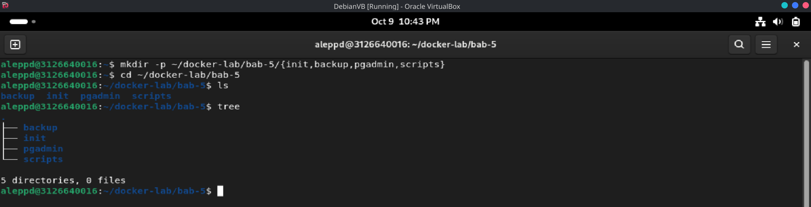

*Gambar 1. Struktur direktori `bab-5` yang memisahkan `init`, `backup`, `pgadmin`, dan `scripts`.*

### 4.2 File `.env.example`

Berkas ini menyimpan template variabel lingkungan untuk PostgreSQL dan pgAdmin, lalu disalin menjadi `.env` agar Compose dapat melakukan interpolasi. Nilai di dalamnya hanya credential sintetis untuk laboratorium, bukan rahasia produksi. Perintah `chmod 600` memastikan hanya pemilik yang dapat membaca `.env`, sehingga credential tidak mudah terekspos ke user lain di host yang sama.

```bash
nano .env.example
cp .env.example .env
chmod 600 .env
cat .env.example
cat .env
```

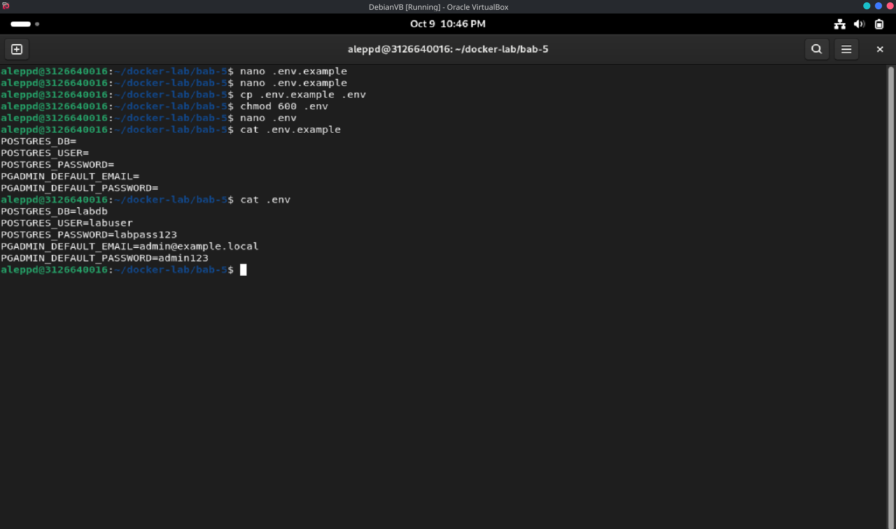

*Gambar 2a. Pembuatan `.env.example`, penyalinan menjadi `.env`, dan penerapan `chmod 600`.*

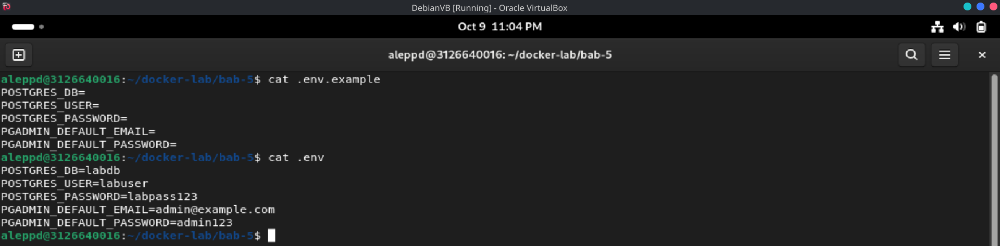

*Gambar 2b. Isi `.env` yang telah disesuaikan, termasuk email pgAdmin yang valid.*

### 4.3 File `.gitignore`

Berkas ini mencegah `.env`, berkas dump, dan checksum masuk ke repository Git. Tanpa `.gitignore`, credential dan data mahasiswa berpotensi ter-commit dan bocor melalui riwayat Git.

```bash
nano .gitignore
cat .gitignore
```

```text
.env
backup/*.dump
backup/*.sha256
backup/*.log
```

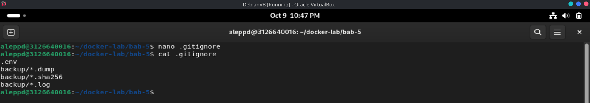

*Gambar 3. Isi `.gitignore` yang mengecualikan `.env` dan artefak backup dari repository.*

### 4.4 File `compose.yaml`

Berkas ini mendefinisikan dua service utama, yaitu `postgres-db` dan `pgadmin`, yang dihubungkan melalui network `data-net` dan memakai volume `pg-data` serta `pgadmin-data`. Port PostgreSQL dan pgAdmin dibatasi ke `127.0.0.1` agar tidak terbuka ke seluruh interface host, dan healthcheck `pg_isready` memastikan pgAdmin baru dijalankan setelah database benar-benar siap.

```yaml
services:
  postgres-db:
    image: postgres:16-alpine
    environment:
      POSTGRES_DB: ${POSTGRES_DB}
      POSTGRES_USER: ${POSTGRES_USER}
      POSTGRES_PASSWORD: ${POSTGRES_PASSWORD}
    ports:
      - "127.0.0.1:5432:5432"
    volumes:
      - pg-data:/var/lib/postgresql/data
      - ./init:/docker-entrypoint-initdb.d:ro
      - ./backup:/backup
    networks:
      - data-net
    healthcheck:
      test: ["CMD-SHELL", "pg_isready -U ${POSTGRES_USER} -d ${POSTGRES_DB}"]
      interval: 5s
      timeout: 5s
      retries: 10
      start_period: 10s
    restart: unless-stopped

  pgadmin:
    image: dpage/pgadmin4:latest
    environment:
      PGADMIN_DEFAULT_EMAIL: ${PGADMIN_DEFAULT_EMAIL}
      PGADMIN_DEFAULT_PASSWORD: ${PGADMIN_DEFAULT_PASSWORD}
    ports:
      - "127.0.0.1:5050:80"
    volumes:
      - pgadmin-data:/var/lib/pgadmin
      - ./pgadmin/servers.json:/pgadmin4/servers.json:ro
    networks:
      - data-net
    depends_on:
      postgres-db:
        condition: service_healthy

volumes:
  pg-data:
  pgadmin-data:

networks:
  data-net:
```

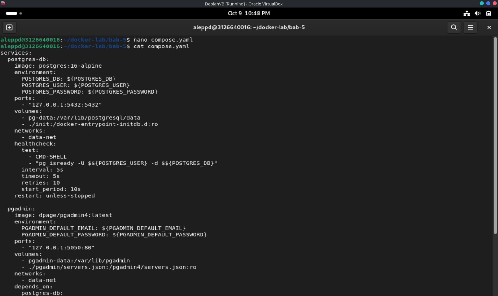

*Gambar 4. Penulisan `compose.yaml` yang mendefinisikan service `postgres-db` dan `pgadmin`.*

### 4.5 File `init/01-schema.sql`

Berkas ini dijalankan otomatis oleh entrypoint PostgreSQL hanya ketika volume data masih kosong. Fungsinya membuat tabel `students`, mengisi dua baris data awal, dan menambahkan indeks pada kolom `name`. Karena hanya dieksekusi sekali, perubahan skema berikutnya harus melalui mekanisme migrasi, bukan mengedit berkas ini.

```sql
CREATE TABLE IF NOT EXISTS students (
  id BIGSERIAL PRIMARY KEY,
  nrp VARCHAR(20) UNIQUE NOT NULL,
  name TEXT NOT NULL,
  created_at TIMESTAMPTZ NOT NULL DEFAULT CURRENT_TIMESTAMP
);

INSERT INTO students (nrp, name) VALUES
  ('31230001', 'Mahasiswa Satu'),
  ('31230002', 'Mahasiswa Dua')
ON CONFLICT (nrp) DO NOTHING;

CREATE INDEX IF NOT EXISTS idx_students_name ON students (name);
```

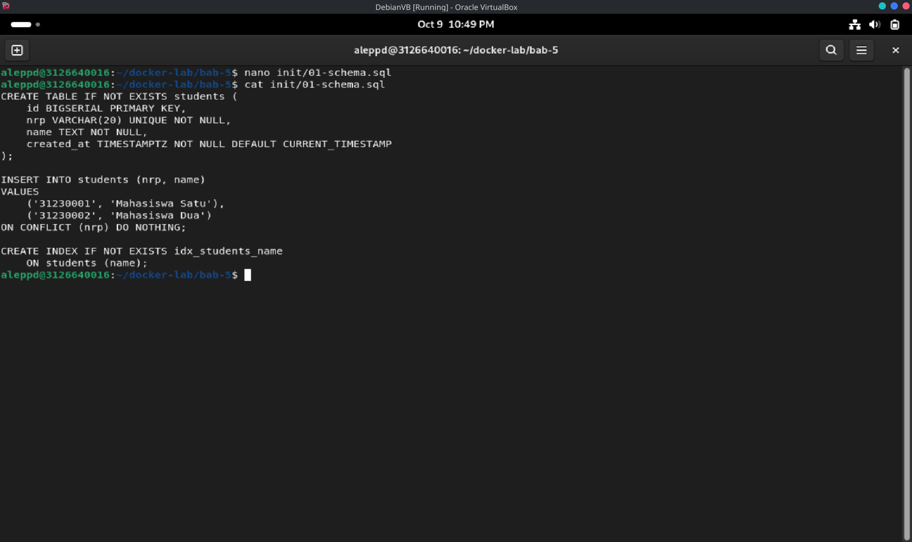

*Gambar 5. Penulisan `init/01-schema.sql` yang membuat tabel `students`, data awal, dan indeks `name`.*

### 4.6 File `pgadmin/servers.json`

Berkas ini mendaftarkan server PostgreSQL ke pgAdmin dengan hostname `postgres-db`, bukan `localhost`. Di dalam container pgAdmin, `localhost` menunjuk ke container pgAdmin itu sendiri, sehingga harus memakai nama service pada network Compose.

```json
{
  "Servers": {
    "1": {
      "Name": "PostgreSQL Bab 5",
      "Group": "Laboratorium DevSecOps",
      "Host": "postgres-db",
      "Port": 5432,
      "MaintenanceDB": "labdb",
      "Username": "labuser",
      "SSLMode": "prefer"
    }
  }
}
```

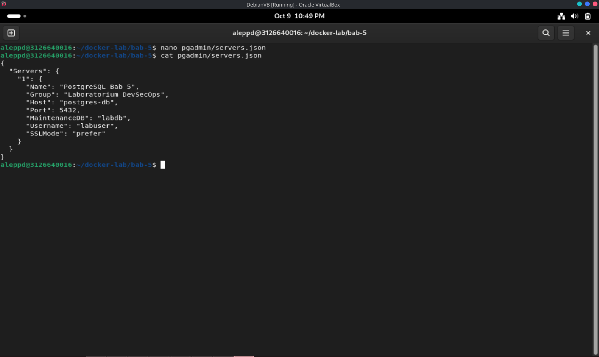

*Gambar 6. Penulisan `pgadmin/servers.json` yang mendaftarkan server dengan host `postgres-db`.*

### 4.7 File `scripts/backup.sh`

Script ini membuat logical backup dengan `pg_dump` format custom, lalu menghitung checksum SHA-256. Fungsinya memastikan berkas dump tidak kosong dan dapat diverifikasi integritasnya sebelum digunakan untuk restore.

```bash
#!/usr/bin/env bash
set -Eeuo pipefail

cd "$(dirname "$0")/.."

if [[ ! -f .env ]]; then
  echo "[FAIL] File .env tidak ditemukan." >&2
  exit 1
fi

set -a
source .env
set +a

mkdir -p backup

timestamp="$(date -u +%Y%m%dT%H%M%SZ)"
dump_file="backup/${POSTGRES_DB}-${timestamp}.dump"
checksum_file="${dump_file}.sha256"

docker compose exec -T postgres-db \
  pg_dump \
  --username "${POSTGRES_USER}" \
  --dbname "${POSTGRES_DB}" \
  --format custom \
  --no-owner \
  --no-privileges \
  > "$dump_file"

test -s "$dump_file"
sha256sum "$dump_file" > "$checksum_file"

echo "[PASS] Backup: $dump_file"
echo "[PASS] Checksum: $checksum_file"
```

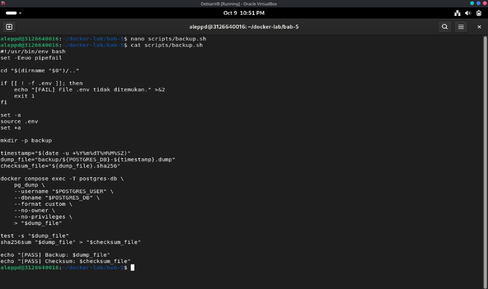

*Gambar 7. Penulisan `scripts/backup.sh` yang melakukan `pg_dump` dan menghitung checksum SHA-256.*

### 4.8 File `scripts/restore-test.sh`

Script ini mengembalikan backup ke database terpisah bernama `labdb_restore_test`, bukan menimpa `labdb`. Tujuannya agar uji restore tidak merusak data utama dan hasilnya dapat diverifikasi secara independen.

```bash
#!/usr/bin/env bash
set -Eeuo pipefail

cd "$(dirname "$0")/.."

if [[ ! -f .env ]]; then
  echo "[FAIL] File .env tidak ditemukan." >&2
  exit 1
fi

set -a
source .env
set +a

dump_file="${1:-}"
restore_database="${POSTGRES_DB}_restore_test"

if [[ -z "$dump_file" || ! -s "$dump_file" ]]; then
  echo "Penggunaan: $0 backup/nama-file.dump" >&2
  exit 1
fi

if [[ -f "${dump_file}.sha256" ]]; then
  sha256sum --check "${dump_file}.sha256"
fi

docker compose exec -T postgres-db \
  dropdb --username "${POSTGRES_USER}" --if-exists "$restore_database"

docker compose exec -T postgres-db \
  createdb --username "${POSTGRES_USER}" "$restore_database"

docker compose exec -T postgres-db \
  pg_restore \
  --username "${POSTGRES_USER}" \
  --dbname "$restore_database" \
  --no-owner \
  --no-privileges \
  < "$dump_file"

echo "[PASS] Restore berhasil ke database: $restore_database"
```

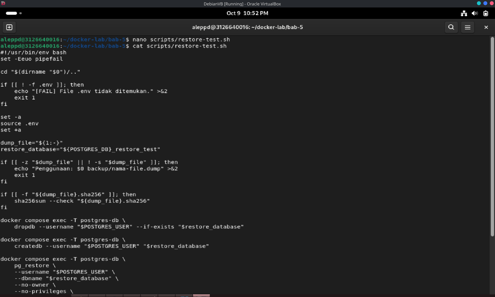

*Gambar 8. Penulisan `scripts/restore-test.sh` yang me-restore ke database `labdb_restore_test`.*

### 4.9 Permission dan Validasi

Memberikan izin eksekusi pada kedua script dan memvalidasi `compose.yaml` sebelum stack dijalankan. Langkah ini mencegah error runtime yang tidak perlu dan memastikan hanya dua service yang akan dibuat.

```bash
chmod +x scripts/backup.sh scripts/restore-test.sh
find . -maxdepth 3 -type f | sort
docker compose config
docker compose config --services
```

| | |
| --- | --- |
| 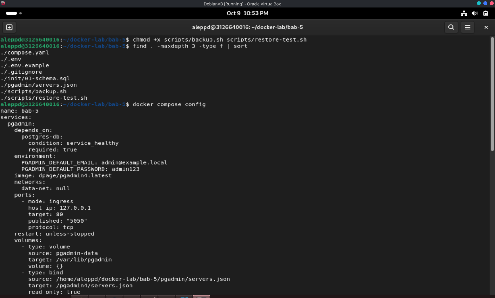 | 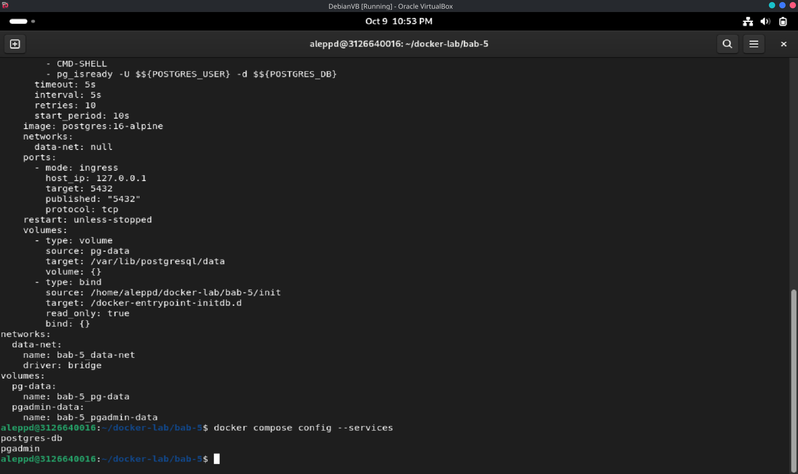 |
| *Gambar 9a. Pemberian izin eksekusi script dan pemeriksaan struktur berkas dengan `find`.* | *Gambar 9b. Validasi model dengan `docker compose config` dan `--services`.* |

### 4.10 Menjalankan Stack

Menjalankan PostgreSQL dan pgAdmin secara terurut menggunakan `depends_on` dengan kondisi `service_healthy`. PostgreSQL harus berstatus `healthy` sebelum pgAdmin dijalankan agar koneksi awal tidak gagal. pgAdmin diakses melalui `http://localhost:5050` menggunakan credential pada `.env`.

```bash
docker compose up -d
docker compose ps
docker compose logs --tail 100
```

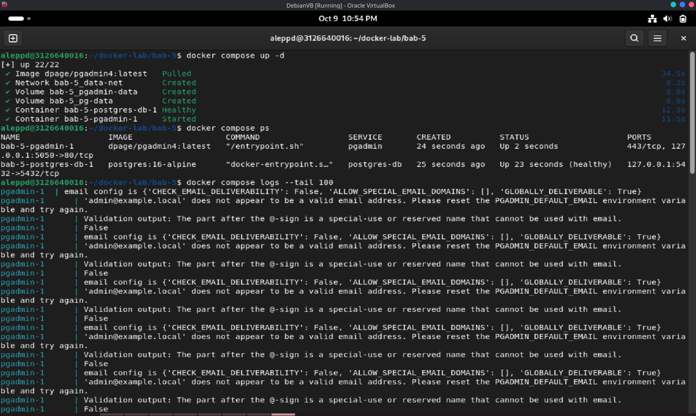

*Gambar 10a. `docker compose up -d` dan `docker compose ps`, serta cuplikan log yang menampilkan galat validasi email pgAdmin.*

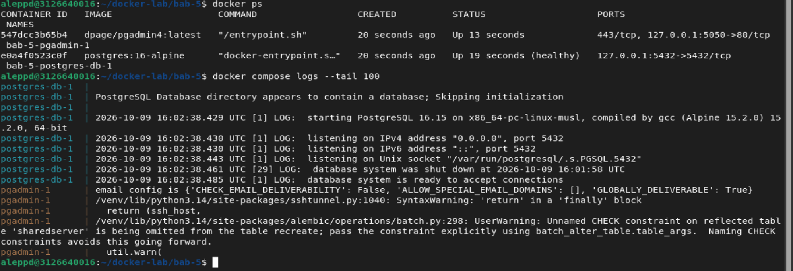

*Gambar 10b. Status container dan cuplikan `docker compose logs --tail 100` PostgreSQL serta pgAdmin.*

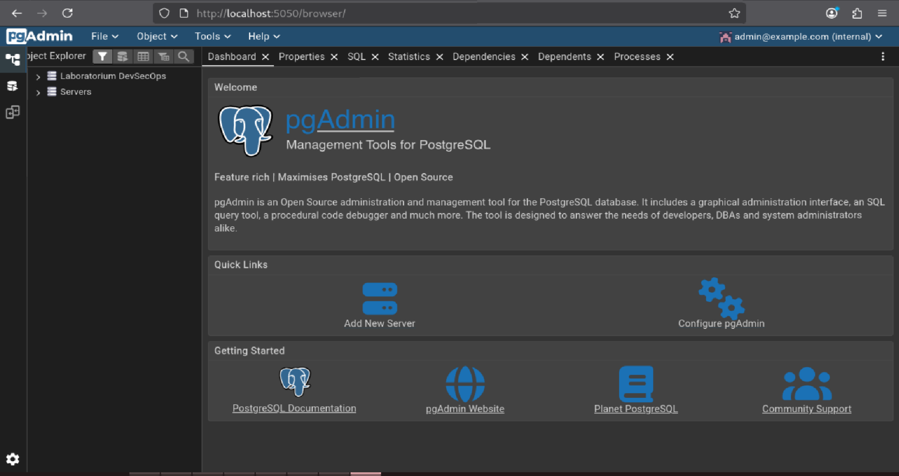

*Gambar 10c. pgAdmin berhasil dibuka pada `http://localhost:5050` dan login sebagai `admin@example.com`.*

### 4.11 Uji Schema dan Data Awal

Menguji apakah init script benar-benar tereksekusi dengan menampilkan daftar tabel dan isi tabel `students`. Jika tabel tidak muncul, penyebab paling umum adalah volume lama masih terpasang sehingga init script dilewati.

```bash
docker compose exec -T postgres-db psql -U labuser -d labdb -c "\dt"
docker compose exec -T postgres-db psql -U labuser -d labdb \
  -c "SELECT id, nrp, name, created_at FROM students ORDER BY id;"
```

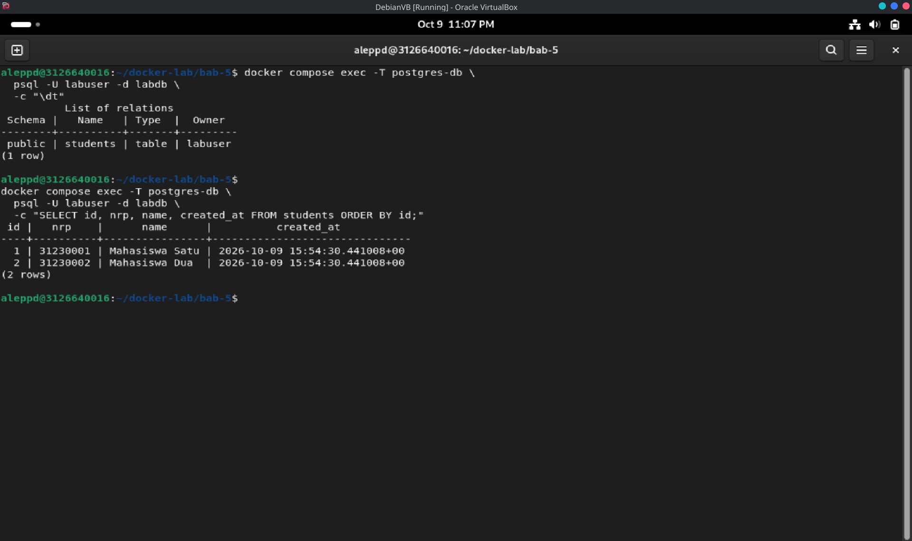

*Gambar 11. Tabel `students` berhasil dibuat dan berisi dua baris data awal hasil init script.*

### 4.12 Uji Persistensi Volume

Menambahkan satu record, mematikan stack tanpa menghapus volume, lalu menyalakannya kembali. Jika record tetap ada, berarti `pg-data` benar-benar menyimpan data di luar lifecycle container.

```bash
docker compose exec -T postgres-db psql -U labuser -d labdb \
  -c "INSERT INTO students(nrp, name) VALUES ('31230003', 'Mahasiswa Tiga') ON CONFLICT DO NOTHING;"
docker compose down
docker compose up -d
docker compose exec -T postgres-db psql -U labuser -d labdb \
  -c "SELECT nrp, name FROM students ORDER BY nrp;"
```

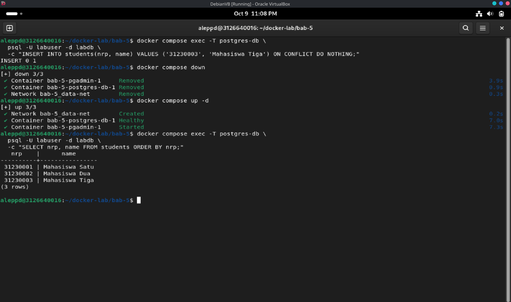

*Gambar 12. Record `31230003` tetap ada setelah `docker compose down` dan `up`, membuktikan persistensi `pg-data`.*

### 4.13 Backup

Menjalankan script backup untuk menghasilkan berkas dump beserta checksum SHA-256. Verifikasi dilakukan dengan memastikan berkas dump berukuran lebih dari nol dan checksum valid, bukan hanya karena berkas ada.

```bash
./scripts/backup.sh
ls -lh backup/
sha256sum --check backup/*.sha256
```


*Gambar 13. Script backup menghasilkan berkas `.dump` dan `.sha256`, lalu checksum diverifikasi dengan `sha256sum --check`.*

### 4.14 Restore Test

Mengembalikan backup ke database `labdb_restore_test` menggunakan script yang telah dibuat. Setelah restore, jumlah baris pada database hasil restore harus sama dengan database sumber sebagai bukti bahwa backup benar-benar dapat dipulihkan.

```bash
latest_dump="$(find backup -maxdepth 1 -name '*.dump' -type f | sort | tail -n 1)"
./scripts/restore-test.sh "$latest_dump"
docker compose exec -T postgres-db psql -U labuser -d labdb_restore_test \
  -c "SELECT nrp, name FROM students ORDER BY nrp;"
```

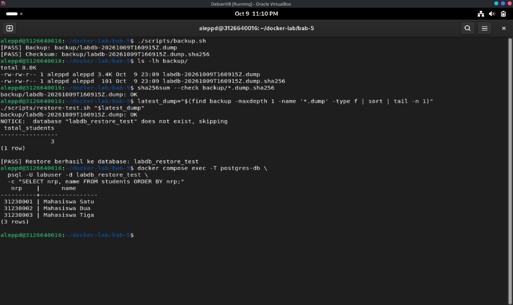

*Gambar 14. Restore berhasil ke `labdb_restore_test` dan jumlah baris hasil restore sama dengan sumber (tiga baris).*

### 4.15 Monitoring Dasar

Memeriksa status container, log PostgreSQL, kesiapan koneksi, versi server, dan penggunaan volume. Langkah ini memastikan tidak ada error tersembunyi dan memberikan baseline sebelum praktikum ditutup.

```bash
docker compose ps
docker compose logs postgres-db --tail 10
docker compose exec -T postgres-db pg_isready -U labuser -d labdb
docker compose exec -T postgres-db psql -U labuser -d labdb -c "SELECT version();"
docker volume ls
docker system df -v
```

| | |
| --- | --- |
| 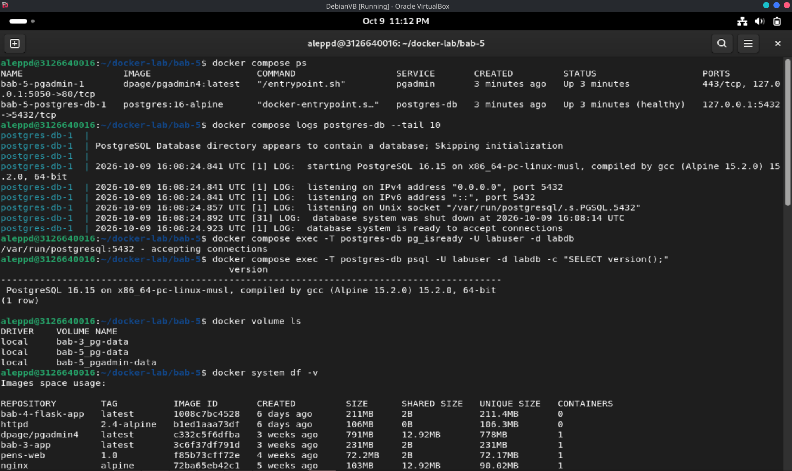 | 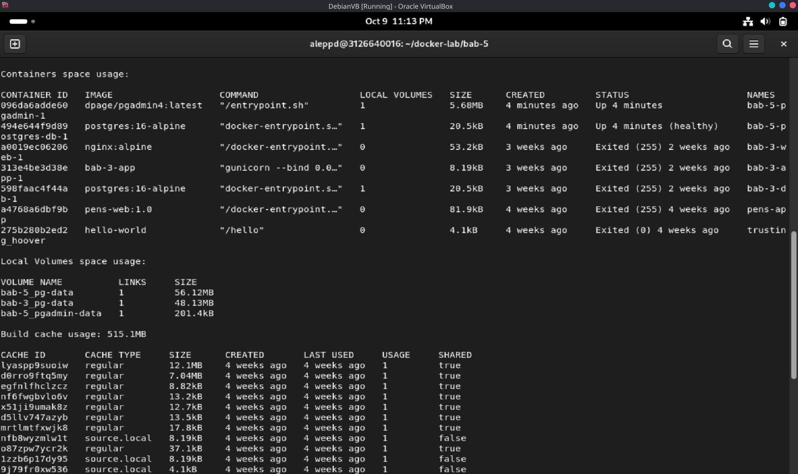 |
| *Gambar 15a. Status container, log PostgreSQL, `pg_isready`, dan versi server.* | *Gambar 15b. Penggunaan volume serta disk melalui `docker system df`.* |

### 4.16 Cleanup

Menghentikan stack tanpa menghapus volume agar data tetap tersimpan, lalu menghapus database hasil restore test. Perintah `down -v` hanya dijalankan jika data laboratorium memang sudah tidak diperlukan.

```bash
docker compose down
docker compose down -v
```

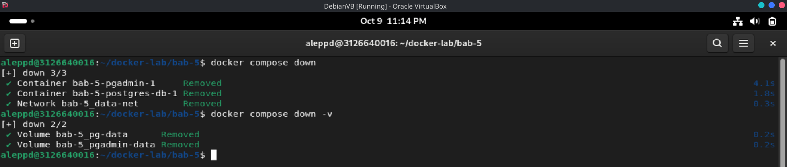

*Gambar 16. `docker compose down` menghapus container dan network, sedangkan `down -v` ikut menghapus volume `pg-data` dan `pgadmin-data`.*

## 5. Hasil Pengujian

### 5.1 Status Service dan Kesiapan Koneksi

```bash
docker compose ps
docker compose exec -T postgres-db pg_isready -U labuser -d labdb
```

Hasil: kedua service berjalan; `postgres-db` berstatus `Up (healthy)` sesuai healthcheck `pg_isready`, dan pgAdmin dapat dibuka pada `http://localhost:5050`. Rincian terlihat pada Gambar 10a, 10b, 10c, dan 15a.

### 5.2 Hasil Uji Schema, Data, dan Persistensi

```bash
docker compose exec -T postgres-db psql -U labuser -d labdb -c "\dt"
docker compose exec -T postgres-db psql -U labuser -d labdb -c "SELECT * FROM students ORDER BY id;"
```

| Pemeriksaan | Hasil | Bukti |
| --- | --- | --- |
| Pembuatan tabel otomatis | Tabel `students` muncul dari `init/01-schema.sql` | Gambar 11 |
| Data awal terisi | Dua baris (`31230001`, `31230002`) tersimpan | Gambar 11 |
| Persistensi volume | Record `31230003` tetap ada setelah `down` lalu `up` | Gambar 12 |

### 5.3 Hasil Backup dan Restore

```bash
./scripts/backup.sh
ls -lh backup/
sha256sum --check backup/*.sha256
./scripts/restore-test.sh "$(find backup -maxdepth 1 -name '*.dump' -type f | sort | tail -n 1)"
```

Hasil: backup menghasilkan berkas `.dump` dan `.sha256`, checksum yang diverifikasi menyatakan `OK`, dan restore ke `labdb_restore_test` berhasil dengan jumlah baris tiga — sama dengan database sumber. Rincian pada Gambar 13 dan Gambar 14.

### 5.4 Checklist Hasil

- [x] PostgreSQL berjalan dengan volume persisten `pg-data`.
- [x] Tabel `students` dibuat otomatis dari init script.
- [x] pgAdmin dapat login dan terkoneksi ke database.
- [x] Backup menghasilkan berkas dump beserta checksum di direktori host.
- [x] Restore sudah diuji ke database terpisah, bukan hanya diasumsikan berhasil.
- [x] Hanya `postgres-db` dan `pgadmin` yang memublikasikan port, dan keduanya dibatasi ke `127.0.0.1`.

### 5.5 Prinsip Troubleshooting

Mulai dari status container, baca logs, cek network, cek volume, lalu validasi konfigurasi. Jangan langsung menghapus volume sebelum memahami apakah data masih dibutuhkan.

```bash
docker compose ps
docker compose logs --tail 100
docker compose exec -T postgres-db pg_isready -U labuser -d labdb
docker network ls
docker volume ls
docker inspect <container-name>
```

## 6. Threat Statement

| Unsur | Isi |
| --- | --- |
| Aset | Data PostgreSQL pada volume `pg-data`, credential database dan pgAdmin pada `.env`, berkas dump pada `backup/`, serta konfigurasi `compose.yaml`, `init/01-schema.sql`, dan `pgadmin/servers.json` |
| Aktor ancaman | Penyerang eksternal yang menjangkau port host, pengguna lokal yang tidak berwenang pada host atau repository, pihak yang memperoleh akses ke berkas `.env` atau bind mount `backup/`, serta proses/aplikasi lain di host yang dapat menjangkau loopback |
| Jalur serangan | Kredensial plaintext pada `.env`/`compose.yaml`; publikasi port PostgreSQL ke loopback yang masih dapat dijangkau proses lokal; koneksi tanpa TLS (`sslmode=prefer`); backup tanpa enkripsi dan rotasi; ketiadaan WAL archiving/PITR; healthcheck yang hanya memeriksa `pg_isready`; serta tidak adanya resource limit |
| Dampak | Kebocoran kredensial dan data penuh melalui dump yang tidak terenkripsi, penyadapan trafik 5432, kehilangan data karena `down -v` atau RPO yang terbatas pada backup terakhir, gangguan service lain di host karena beban tak terbatas, serta sulitnya forensik |

**Threat statement:** Aset yang dilindungi adalah data PostgreSQL pada volume `pg-data`, credential database dan pgAdmin, berkas dump pada direktori `backup/`, serta konfigurasi stack. Aktor ancaman dapat berupa penyerang eksternal yang menjangkau port host, pengguna lokal yang tidak berwenang, maupun pihak yang memperoleh akses ke `.env` atau bind mount `backup/`. Jalur serangan meliputi credential plaintext pada `.env`, publikasi port PostgreSQL ke loopback yang tetap dapat dijangkau proses lokal, koneksi tanpa TLS, backup yang tidak terenkripsi dan tanpa rotasi, ketiadaan WAL archiving untuk PITR, healthcheck yang hanya memeriksa `pg_isready`, serta absennya resource limit. Dampak yang mungkin terjadi adalah kebocoran kredensial dan data, penyadapan trafik basis data, kehilangan data karena `down -v` atau RPO yang hanya sebatas backup terakhir, gangguan pada service lain di host, serta buruknya ketelusuran insiden.

## 7. Analisis

### 7.1 Masalah yang Muncul dan Cara Mendiagnosisnya

Saya mengalami kendala saat mengakses `http://localhost:5050` untuk pgAdmin. Email `admin@example.local` yang terpasang pada `.env` ditolak pgAdmin: log container menampilkan pesan `'admin@example.local' does not appear to be a valid email address`. Cara mendiagnosisnya sesuai prinsip troubleshooting adalah mulai dari status container (`docker compose ps`), lalu membaca log dengan `docker compose logs pgadmin`, yang menunjukkan bahwa galat berasal dari validasi `PGADMIN_DEFAULT_EMAIL` — domain `.local` dianggap tidak valid. Setelah email saya ubah menjadi `admin@example.com` dan stack dijalankan ulang, pgAdmin dapat dibuka dan login berhasil (Gambar 10c). Pelajaran dari kasus ini adalah healthcheck hanya menyatakan container hidup; pemeriksaan fungsional seperti login tetap harus dilakukan secara nyata.

### 7.2 Risiko Keamanan atau Operasional yang Relevan

**Pertama**, credential pada `.env` dan `compose.yaml` mudah terekspos melalui `docker compose config`, riwayat shell, atau inspeksi container; untuk produksi harus dipasang melalui secret manager atau Docker secret. **Kedua**, koneksi database tanpa TLS membuat trafik port 5432 rentan disadap bila network tidak sepenuhnya dipercaya, dan `SSLMode: prefer` pada pgAdmin tidak memaksa enkripsi. **Ketiga**, port PostgreSQL yang dipublikasikan ke loopback masih dapat diakses oleh proses lokal yang tidak berkepentingan; pada deployment nyata sebaiknya database sama sekali tidak dipublikasikan dan hanya diakses dari network internal. **Keempat**, backup tanpa rotasi dan enkripsi berisiko kebocoran data serta kehabisan storage karena dump berisi data penuh termasuk kolom sensitif. **Kelima**, belum ada WAL archiving atau PITR sehingga RPO hanya sebatas waktu backup terakhir. **Keenam**, healthcheck `pg_isready` hanya menunjukkan server menerima koneksi, bukan bahwa migrasi, constraint, atau query bisnis benar-benar berjalan. **Ketujuh**, tidak ada resource limit pada container PostgreSQL sehingga beban berat dapat mengganggu service lain di host. **Kedelapan**, init script menyimpan data contoh dengan NRP nyata yang berpotensi melanggar kebijakan data pribadi bila dipakai di luar laboratorium.

### 7.3 Rekomendasi Perbaikan untuk Production-like Environment

1. **Secret management:** pindahkan `POSTGRES_PASSWORD` dan credential pgAdmin ke Docker secret, Vault, atau secret manager cloud; jangan gunakan `.env` untuk produksi.
2. **Network dan akses:** hilangkan published port PostgreSQL, gunakan network `internal: true`, dan batasi akses hanya dari service yang membutuhkan; untuk trafik lintas host aktifkan TLS dengan `sslmode=verify-full`.
3. **Least privilege:** pisahkan role aplikasi (read-write terbatas), role migrasi, role backup, dan role observability; superuser hanya untuk operasi administrasi.
4. **Backup dan recovery:** aktifkan WAL archiving untuk PITR, enkripsi dump, simpan salinan di lokasi berbeda, dan lakukan restore exercise berkala untuk mengukur RTO/RPO.
5. **Monitoring:** tambah metrik `pg_stat_activity`, jumlah koneksi, lock, pertumbuhan disk, dan replication lag; kirim log ke centralized logging dengan timestamp UTC.
6. **Healthcheck berlapis:** tambahkan readiness yang menjalankan query representatif dan memeriksa status migrasi, bukan hanya `pg_isready`.
7. **Resource limit:** tetapkan `mem_limit`, `cpus`, dan `restart: unless-stopped` pada service PostgreSQL dan pgAdmin.
8. **Migrasi terversi:** gunakan tool seperti Flyway, Liquibase, atau Alembic; jangan mengandalkan `docker-entrypoint-initdb.d` untuk perubahan skema.
9. **Image pinning:** ganti `postgres:16-alpine` dan `dpage/pgadmin4:latest` menjadi tag versi spesifik, lalu pindai image dengan Trivy atau Grype sebelum dipakai.
10. **Governance:** perlakukan `compose.yaml`, `init/*.sql`, dan script backup sebagai code di Git, sertakan lint, integration test, dan rollback plan; dokumentasikan siapa yang boleh mengubah skema dan siapa yang menerima residual risk.

### 7.4 Evaluasi dan Latihan Mandiri

**1. Mengapa init script tidak dijalankan ulang saat volume lama masih ada?**
Entrypoint PostgreSQL hanya mengeksekusi berkas di `/docker-entrypoint-initdb.d` ketika direktori data masih kosong. Jika volume `pg-data` sudah berisi cluster PostgreSQL, entrypoint menganggap database telah terinisialisasi dan melewati seluruh init script, sehingga perubahan skema berikutnya harus melalui mekanisme migrasi.

**2. Apa risiko menaruh password database pada `docker-compose.yml`?**
Password menjadi bagian dari konfigurasi yang mudah terlihat melalui `docker compose config`, riwayat Git, atau inspeksi container. Siapa pun yang dapat membaca berkas itu memperoleh kredensial penuh, dan rotasi menjadi sulit karena nilainya tertanam di banyak tempat.

**3. Bagaimana cara membuktikan backup dapat dipulihkan?**
Dengan melakukan restore ke instance atau database terpisah, lalu membandingkan jumlah baris dan checksum logis dengan sumber. Berkas dump yang ada tetapi belum pernah diuji restore belum dapat dianggap sebagai backup yang sah.

**4. Apa bedanya logical backup `pg_dump` dan backup filesystem volume mentah?**
`pg_dump` menghasilkan representasi logis berisi skema dan data yang portabel antar versi PostgreSQL minor serta dapat direstore selektif. Backup filesystem menyalin berkas data mentah sehingga hanya konsisten bila cluster dalam keadaan berhenti atau snapshot storage diambil secara atomik, dan terikat pada versi PostgreSQL tertentu.

**5. Apa dampak `docker compose down -v` terhadap database?**
Perintah ini menghapus container sekaligus volume `pg-data` dan `pgadmin-data`. Seluruh data PostgreSQL hilang permanen dan init script akan berjalan ulang pada volume baru, sehingga data yang belum di-backup tidak dapat dipulihkan.

## 8. Tindak Lanjut

1. Memindahkan credential dari `.env` ke Docker secret atau secret manager sebelum stack digunakan di luar lingkungan disposable.
2. Menghilangkan publikasi port PostgreSQL dan menandai network `data-net` sebagai `internal: true` agar database hanya dijangkau dari dalam stack.
3. Mengaktifkan WAL archiving untuk PITR, mengenkripsi dump, dan menyimpan salinan di lokasi berbeda dengan rotasi berkala.
4. Menambahkan resource limit (`mem_limit`, `cpus`) dan healthcheck berlapis yang menjalankan query representatif.
5. Mengganti tag `latest` pada pgAdmin dengan tag versi spesifik dan memindai image dengan Trivy atau Grype.
6. Melanjutkan ke bab berikutnya dengan menerapkan centralized logging untuk menampung log PostgreSQL dan pgAdmin secara terstruktur.

## 9. Kesimpulan

1. PostgreSQL dan pgAdmin berhasil dijalankan sebagai stack Docker Compose dengan volume persisten `pg-data` dan `pgadmin-data`, serta healthcheck `pg_isready` yang memastikan pgAdmin baru dijalankan setelah database siap.
2. Init script `init/01-schema.sql` membuat tabel `students` beserta data awal, dan uji persistensi membuktikan data bertahan melintasi lifecycle container (`down` lalu `up`).
3. Backup logis dengan `pg_dump` menghasilkan dump beserta checksum SHA-256, dan restore diuji secara nyata ke database terpisah `labdb_restore_test` dengan jumlah baris yang sama dengan sumber.
4. Kendala email pgAdmin yang tidak valid pada `.env` berhasil didiagnosis melalui pembacaan log container, sekaligus menjadi pengingat bahwa healthcheck saja tidak cukup untuk menyatakan layanan berfungsi.
5. Praktikum ini masih memiliki celah berupa credential pada `.env`, koneksi tanpa TLS, backup tanpa enkripsi, ketiadaan PITR, healthcheck yang terbatas, dan absennya resource limit; untuk production-like diperlukan secret terkelola, network internal, backup terenkripsi dengan uji restore berkala, migrasi terversi, serta pinning image.

## 10. Referensi

1. Ferry Astika Saputra, "Bab 5 — Database Service di Docker: PostgreSQL," repository DevSecOps PENS, `bab-05.md`: https://github.com/ferryas-pens/devsecops/blob/main/bab-05.md
2. PostgreSQL Documentation, *Backup and Restore*: https://www.postgresql.org/docs/current/backup.html
3. PostgreSQL Documentation, *pg_dump*: https://www.postgresql.org/docs/current/app-pgdump.html
4. Docker Documentation, *Postgres — Docker Official Image*: https://hub.docker.com/_/postgres
5. pgAdmin Documentation: https://www.pgadmin.org/docs/
6. Docker Documentation, *Compose Specification*: https://docs.docker.com/compose/compose-file/
